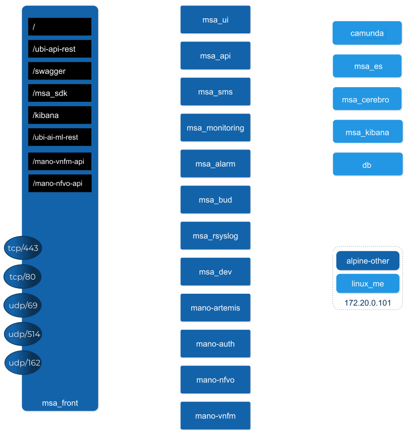

= Architecture Overview
:doctype: book
:imagesdir: ./resources
ifdef::env-github,env-browser[:outfilesuffix: .adoc]
:toc: left
:toclevels: 4 

The {product_name} is an Integrated Automation Platform, which consists of several components running on Docker containers.

[#overview]
== Overview of the platform
- The {product_name} API server: this server provides a REST API layer on top of all the functions, it also provides the Workflow Engine responsible for executing the automated processes
- The {product_name} Core Engine: this component, composed of several daemons is responsible for the configuration of the Managed Entities, the assurance and collecting the syslogs.
- A PostgreSQL database: the {product_name} stores its state in a PostgreSQL database.
- An Elasticsearch cluster: the {product_name} collects and stores the events and the alarms in an Elasticsearch server.
- A BPM engine based on Camunda, fully integrated with Workflow Engine.
- A Subversion based server to store the history of the configurations of the Managed Entities
- REST API and UI: To control the {product_name}, you can use either the web based interface or the REST API.

== Overview of the docker containers

=== Containers description

- msa_front: runs NGINX and act as the front end
- msa_ui: run the web portal
- msa_api: run the REST API webapp on Wildfly
- msa_sms: runs the CoreEngine for configuration and assurance of the managed entities
- msa_bud: takes care of cross table data synchronisation and consistency in the database
- msa_dev: linux based container for storing the assets shared accross containers such as microservices, workflows, adapters code,...
- camunda: BPM engine
- msa_es: Elasticsearh container
- msa_cerebro: Cerebro is a web based management tool for Elasticsearch
- db: PostgreSQL database

=== Networking and connectivity
image:images/non_ha_containers.png[width=1000px]
