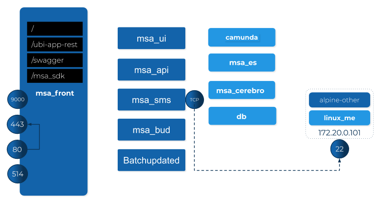
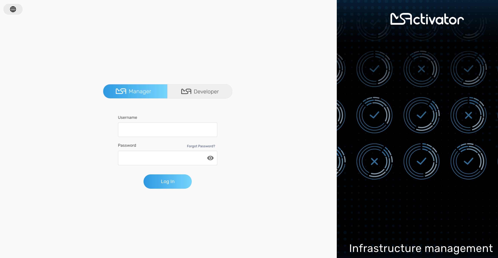

= Installation Guide
:imagesdir: ./resources/
ifdef::env-github,env-browser[:outfilesuffix: .adoc]

TIP: this document elaborates on https://github.com/ubiqube/docs/tree/master/docker

== Overview

The {product_name} docker application has the following structure:



The application ships as:
- docker-compose.yml
- set of images, available from dockerhub:ubiqube/msa2

== Installing the application

The following assumes you have a docker engine at hand,
with internet access.


Browse to https://github.com/ubiqube/docs/tree/master/docker
and follow the steps.

In a nutshell:

* download https://github.com/ubiqube/docs/tree/master/docker/docker-compose.yml
* docker-compose up -d


Then browse to: https://localhost with the credentials ncroot/ubiqube



== Install steps

=== Install MSA-v2 on your docker engine

1. check your dockerhub account password - or create a new account
2. ask for access to private repo: `ubiqube/msa2`
3. check your docker engine has access to dockerhub
4. create a new directory: `ddmsa/`
5. cd `ddmsa/`
6. download: [docker-compose.yml][docker-compose]
7. run: `docker login`
8. run: `docker-compose up -d`
9. browse: https://localhost/


=== Requirements on the host machine

The host machine should have hardware specs similar to that
of the VM running the .ova flavour of MSA:

- 16Go, 4CPU, 100Go

=== Docker for Linux (or Linux VM)
----
sudo sysctl -w vm.max_map_count=262144
sudo tee -a /etc/sysctl.conf <<< "vm.max_map_count=262144"
----

== Docker for Mac

From the command line, run:
----
screen ~/Library/Containers/com.docker.docker/Data/vms/0/tty
----	
Press enter and use`sysctl` to configure vm.max_map_count:
----
sysctl -w vm.max_map_count=262144
----	
To exit the screen session, type Ctrl a d.

=== Docker for Windows
----
docker-machine create -d virtualbox  \
	--virtualbox-cpu-count=2 \
	--virtualbox-memory=8192 \
	--virtualbox-disk-size=50000 \
	default
----

In the docker VM, do as for Linux host above:
----
sudo sysctl -w vm.max_map_count=262144
sudo tee -a /etc/sysctl.conf <<< "vm.max_map_count=262144"
----

The docker VM is mapped to a local IP on the Windows host,
access to the msa is _NOT_ done via `https://localhost`,
you must lookup the IP with:

```
$ docker-machine ls
NAME      ACTIVE   DRIVER       STATE     URL                         SWARM   DOCKER     ERRORS
default   *        virtualbox   Running   tcp://192.168.99.100:2376           v19.03.5
```
Below is a sample install session.

== Sample install session

The following makes direct use of a git clone of this repo.

.clone this repo
----
$ git clone https://github.com/ubiqube/docs.git gh.ubi.docs
[...]

$ cd gh.ubi.docs/docker
----

.docker-compose up -d
----
$ docker-compose up -d
----

.ouptut
----
Creating network "docker_default" with the default driver
Creating volume "docker_monitoring" with default driver
Creating volume "docker_license" with default driver
Creating volume "docker_repo.contents" with default driver
Creating volume "docker_db" with default driver
Creating volume "docker_kibana" with default driver
Creating volume "docker_repo.entities" with default driver
Creating volume "docker_change-mgt" with default driver
Creating volume "docker_es" with default driver
Pulling db (ubiqube/msa2:db-20.0)...
ERROR: pull access denied for ubiqube/msa2, repository does not exist or may require 'docker login'
----

.docker login
----
$ docker login
----

.output
----
Login with your Docker ID to push and pull images from Docker Hub. If you don't have a Docker ID, head over to https://hub.docker.com to create one.
Username: ofa4ubi
Password:
Login Succeeded
----

.docker-compose up -d  (again)
----
$ docker-compose up -d
----

.output
----
Pulling db (ubiqube/msa2:db-20.0)...
db-20.0: Pulling from ubiqube/msa2
923e5b97c6ca: Downloading [===>                                               ]  206.3MB/2.677GB
88eb9217dbf6: Download complete

[...]

Pulling api (ubiqube/msa2:api-20.0)...
api-20.0: Pulling from ubiqube/msa2
923e5b97c6ca: Already exists
44bd1be23b47: Pull complete
ee48504090e3: Pull complete
cb38798a1f36: Pull complete
d08aab2cd6ed: Pull complete
4b44f07a2340: Pull complete
907333b6c030: Pull complete
d9e192b60932: Pull complete
8b615636b9ad: Pull complete
Digest: sha256:111e325a14ac76d24ba1d956c97704e0144ea087c3125eb7b725e031728a3641
Status: Downloaded newer image for ubiqube/msa2:api-20.0

Creating docker_es_1 ...
Creating docker_ui_1 ...
Creating docker_kibana_1 ...
Creating docker_front_1 ...
Creating docker_camunda_1 ...
Creating docker_db_1 ...
Creating docker_ui_1
Creating docker_db_1
Creating docker_camunda_1
Creating docker_front_1
Creating docker_kibana_1
Creating docker_es_1 ... done
Creating docker_api_1 ...
Creating docker_api_1 ... done
----

.docker-compose ps
----
$ docker-compose ps
----

.output
----
      Name                  Command            State             Ports
--------------------------------------------------------------------------------
docker_api_1       /sbin/init                  Up      0.0.0.0:2223->22/tcp
docker_camunda_1   /sbin/tini --               Up      8000/tcp, 8080/tcp,
                   ./camunda.sh                        9404/tcp
docker_db_1        run ubi-base                Up
docker_es_1        run elasticsearch           Up
docker_front_1     nginx -g daemon off;        Up      0.0.0.0:443->443/tcp,
                                                       0.0.0.0:514->514/udp,
                                                       0.0.0.0:80->80/tcp
docker_kibana_1    run kibana                  Up
docker_ui_1        nginx -g daemon off;        Up      80/tcp
----


.browse to the web-ui
https://localhost/ (ncroot / ubiqube)

NOTE: There might be a pop-up warning of a self-signed cert that needs to be accepted to proceed.

NOTE: Users might need to wait a few minutes after they access the localhost as it takes a few minutes for the {product_name} to start in the background before they logon
