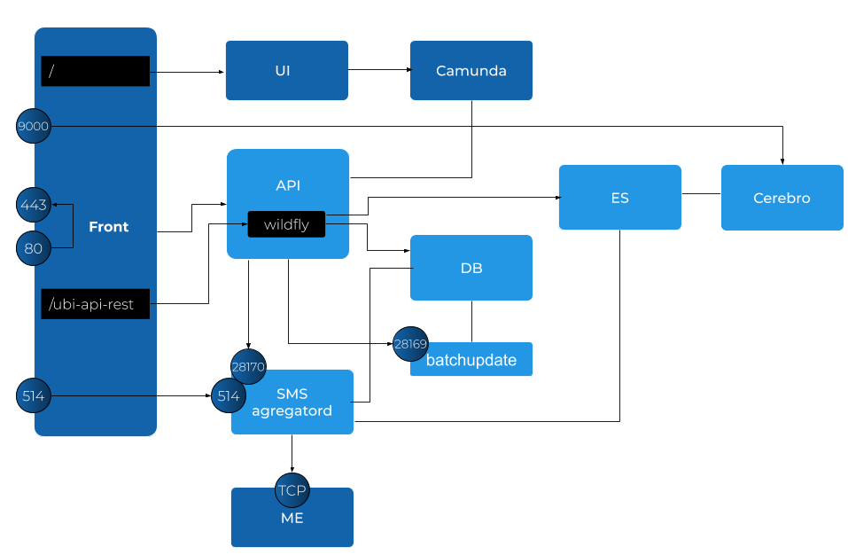

= Installation Guide
:toc: left
:toclevels: 4 
:doctype: book 
:imagesdir: ./resources/
ifdef::env-github,env-browser[:outfilesuffix: .adoc]

== Overview

The {product_name} Docker application has the following structure:



== Prerequisites

Before starting this tutorial, first install link:https://docs.docker.com/install/[Docker] on your machine. 
Next install link:https://docs.docker.com/compose/install/[Docker Compose] on your machine.
You must also have a working internet connection to install the container components.

== Installing the application

The easiest way to get started with the {product_name} is to use the link:https://github.com/ubiqube/quickstart[quickstart guide on github].

This quickstart guide will setup a mini-lab composed of the {product_name} containers as well as a Linux container that you can use to experiment on. (see below for mode details)

include::./doc-src/admin-guide/installation_install_steps.adoc[]

image:images/connection_page.png[]

NOTE: It might take a few minutes after connecting to https://localhost/ to be able to login.

NOTE: There might be a pop-up warning of a self-signed cert that needs to be accepted to proceed.

.Access to Dockerhub
NOTE: To get the access to the UBiqube dockerhub private repository please contact us at msa-trial@ubiqube.com.

When Docker Compose is done deploying and the MSA platform is running, you will be able to open the dashboard at link:https://127.0.0.1[]. 

When you see the following output, the MSA platform is ready to be used

```
Creating quickstart_linux_me_1 ... done
Creating quickstart_es_1       ... done
Creating quickstart_db_1       ... done
Creating quickstart_ui_1       ... done
Creating quickstart_kibana_1   ... done
Creating quickstart_camunda_1  ... done
Creating quickstart_api_1      ... done
Creating quickstart_front_1    ... done
```

If you get a gateway error, the web server is probably still starting and you may have to wait for 10-20 more seconds before trying again.

To get an interactive shell on the MSA main container (this will be needed later)
```
docker-compose exec api bash
```
[#mini-lab]
=== Mini-lab details 
image:images/non_ha_minilab_containers.png[mini lab containers]
 
In addition to a Linux container (linux.me / 172.20.0.101) for experimentation, the mini-lab also comes with the following pre-installed:

. A trial license valid for 30 days, limited to 5 Managed Entities
. The REST Generic adapter from link:https://github.com/openmsa/Adaptors/tree/master/adapters/rest_generic[github.com/openmsa/Adaptors]
. A set of Micorservices from various vendors from link:https://github.com/openmsa/Microservices[github.com/openmsa/Microservices]
. A predefined environment with a tenant and a customer

To automatically create the tenant, the customer and the managed entity, you can run the CLI command:

```
docker-compose exec api /usr/bin/create_mini_lab.sh
```

This will create a tenant, one customer named "Tyrell" and a managed entity named "linux_me" with a fixed management IP 172.20.0.101

image:images/quickstart_linux_me.png[]


You can connect to linux_me with the CLI command `docker-compose exec linux_me bash`

```
$ docker-compose exec linux_me bash

[root@linux_me /]# ifconfig 
eth0      Link encap:Ethernet  HWaddr 02:42:AC:14:00:65  
          inet addr:172.20.0.101  Bcast:172.20.0.255  Mask:255.255.255.0
          UP BROADCAST RUNNING MULTICAST  MTU:1500  Metric:1
          RX packets:29 errors:0 dropped:0 overruns:0 frame:0
          TX packets:3 errors:0 dropped:0 overruns:0 carrier:0
          collisions:0 txqueuelen:0 
          RX bytes:1878 (1.8 KiB)  TX bytes:142 (142.0 b)

lo        Link encap:Local Loopback  
          inet addr:127.0.0.1  Mask:255.0.0.0
          UP LOOPBACK RUNNING  MTU:65536  Metric:1
          RX packets:0 errors:0 dropped:0 overruns:0 frame:0
          TX packets:0 errors:0 dropped:0 overruns:0 carrier:0
          collisions:0 txqueuelen:1000 
          RX bytes:0 (0.0 b)  TX bytes:0 (0.0 b)

[root@linux_me /]# exit
```


== Breaking down/resetting the quickstart environment
To fully clean up or reset the environment, run the following commands:

1. `docker-compose -f docker-compose.yml down`
2. `docker volume prune -f`
3. `docker ps -a | grep "ubiqube" | awk '{print $1}' | xargs docker rm`
4. `docker images | grep "ubiqube" | awk '{print $3}' | xargs docker rmi`

This will give you a clean environment next time you run docker-compose up.

To completely clean up your docker images you can also do `docker rmi $(docker images -a -q)`.

WARNING: this will wipe out every images from your docker engine.

== Upgrading the application

1. a new release or patch is made available
2. the release/patch is published to the dockerhub registry
3. upgrade the {product_name} installation: `sudo docker-compose pull`
4. starts the containers in the background and leaves them running: `sudo docker-compose up -d`

NOTE: if you need to (re)install the {product_name} you can use the link:../user-guide/quickstart{outfilesuffix}[quickstart guide]

== Requirements on the host machine

include::./doc-src/admin-guide/installation_setup_requirement.adoc[]

The docker VM is mapped to a local IP on the Windows host,
access to the msa is _NOT_ done via `https://localhost`,
you must lookup the IP with:

```
$ docker-machine ls
NAME      ACTIVE   DRIVER       STATE     URL                         SWARM   DOCKER     ERRORS
default   *        virtualbox   Running   tcp://192.168.99.100:2376           v19.03.5
```

== Troubleshooting

To access the Troubleshooting Guide, that can be found in the Admin Guide menu.
