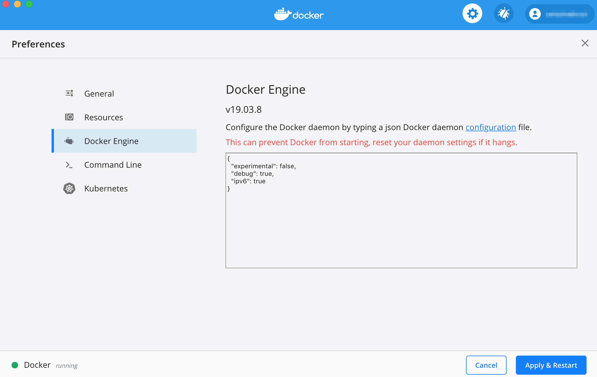

== Setup requirements

=== Internet Resources
 * Ensure you have access from HOST machine(s) to:
 ** https://github.com
 ** https://hub.docker.com

=== Hardware Resources

.on a PC (for lab experimentation)
- minimum memory:4GB (8GB to be comfortable), 2CPU, 100GB

NOTE: with less that 4GB of memory, the {product_name} may not function properly.

.on a production environment 
- minimum 16GB, 4CPU, 200GB

=== Docker optional custom configuration

The custom configuration below may not be needed depending on your host computer and you intended use of the {product_name}. If you are just running the product for evaluation prupose or training, don't worry too much about these at first.

In a production environment, these custom configuration may be mandatory to allow your setup to support a higher workload.

////
=== Support for IPv6

Follow this guide to enable IPv6 on your docker engine: link:https://docs.docker.com/config/daemon/ipv6/[Enable IPv6 support]

You can also use the Docker console to configure IPv6.

////

==== Docker for Linux (or Linux VM)

----
sudo sysctl -w vm.max_map_count=262144
echo 'vm.max_map_count = 262144' > /etc/sysctl.d/50-msa.conf
sudo sysctl -p /etc/sysctl.d/50-msa.conf
----

==== Docker for Mac

From the command line, run:
----
screen ~/Library/Containers/com.docker.docker/Data/vms/0/tty
----	
Press enter and use`sysctl` to configure vm.max_map_count:
----
sysctl -w vm.max_map_count=262144
----	
To exit the screen session, type Ctrl a d.

==== Docker for Windows

----
docker-machine create -d virtualbox  \
	--virtualbox-cpu-count=2 \
	--virtualbox-memory=8192 \
	--virtualbox-disk-size=50000 \
	default
----

In the docker VM, do as for Linux host above:
----
sudo sysctl -w vm.max_map_count=262144
sudo tee -a /etc/sysctl.conf <<< "vm.max_map_count=262144"
----
