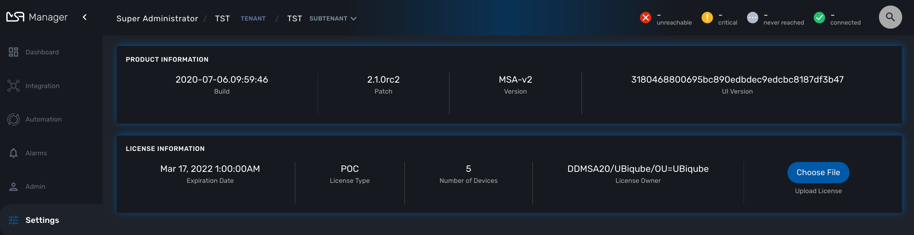

= License Activation
:toc: left
:toclevels: 4 
:doctype: book 
:imagesdir: ./resources/
ifdef::env-github,env-browser[:outfilesuffix: .adoc]

If you have installed the {product_name} with the quickstart, you already have a trial license limited to 5 Managed Entities and valid for 30 days to get started.

In case you are starting to do a longer PoC or need to have a production license, you probably have received a new license from your UBiqube sales representative.
In that case you need to use this documentation to activate the new license.

== License activation

You must be connected as a privileged administrator (ncroot) to install the license.

As a privileged administrator, click on the link "Setting" on the left menu. 

Click on "Choose file..." and select your license file (.lic).

If the license is valid, the web page will display the license information otherwise the license activation will be refused.

