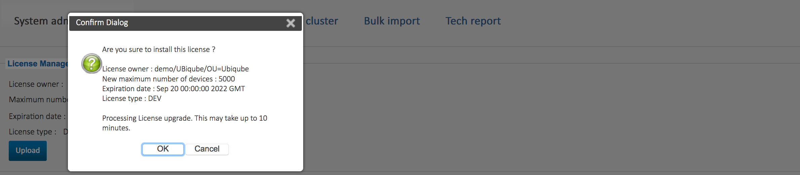

= License Activation
:toc: left
:toclevels: 4 
:doctype: book 
:imagesdir: ./resources/
ifdef::env-github,env-browser[:outfilesuffix: .adoc]

If you have installed the {product_name} with the quickstart, you already have a trial license limited to 5 Managed Entities and valid for 30 days to get started.

In case you are starting to do a longer PoC or need to have a production license, you probably have received a new license from your UBiqube sales representative.
In that case you need to use this documentation to activate the new license.

== License activation

You must be connected as a privileged administrator (ncroot) on the classic portal (/UBI/en) to install the license.

As a privileged administrator, click on the {product_name} setting gear icon at the top right of the screen. 

This will open the system management page where the license management is located.

image::images/classic_msa_admin_page.png[alt={product_name} admin page]

Click on "Upload" and select your license file (.lic).

Once uploaded and before proceeding, the {product_name} will show you the license certificate information (the number of manageable devices and the end of support time). Verify that this information is correct before clicking apply. If this information is not correct, or you wish to change it, contact UBiqube support.

This is an example of the "apply" dialog box:

The web page will display the updated license information.

