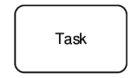
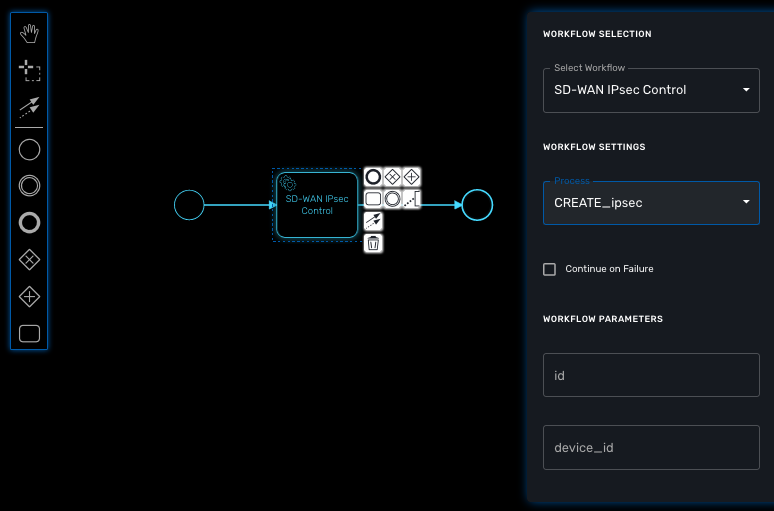

= BPM Editor
:doctype: book 
:imagesdir: ./resources/
ifdef::env-github,env-browser[:outfilesuffix: .adoc]
:source-highlighter: pygments

The BPM editor is a web based UI for designing BPM processes.

== BPM design

To create a new BPM from the developer portal, click on "+ Create" from the BPM Library swimlane. 

You can also browse through the existing BPM by clicking on "See more".

NOTE: you need to select a sub-tenant to see the BPM.

=== Create a new BPM

Click on create to create a new BPM editor.

image:images/bpm_new_editor.png[width=600px]

Use your mouse to add tasks and link them together.

NOTE: A BPM process must have a StartEvent and an EndEvent.

NOTE: Only one executable BPM process can be designed at a time. 

You can save your BPM at anytime and edit it later. When you save you BPM, you need to select a sub-tenant.

NOTE: A BPM is associated to a single sub-tenant.

=== Design a BPM process

The {product_name} BPM engine supports the following BPMN elements:

 the first element of the BPM process.

 indicates the end of the BPM process.

 an executable task that can run workflow processes.

NOTE: Support for more elements will be provided in future link../release_notes{outfilesuffix}[releases]

=== Connecting workflows and processes

Select an executable task to see the list of workflows (based on the sub-tenant selected), then select a process and provide it's input parameters.

