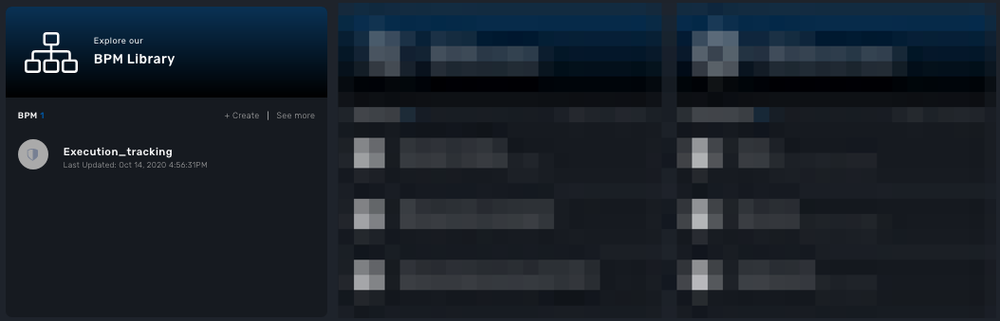
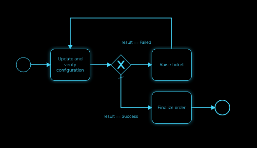
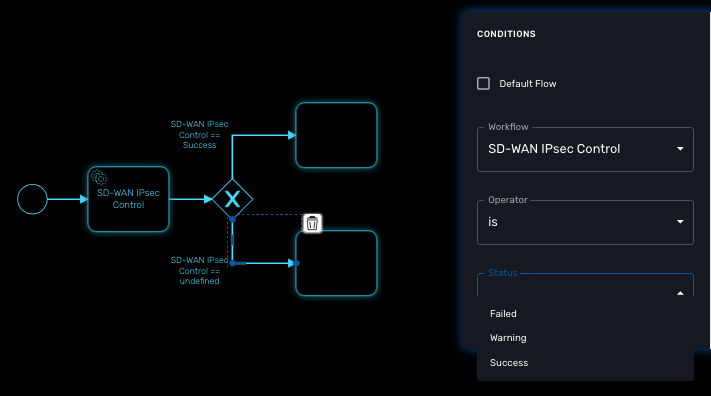
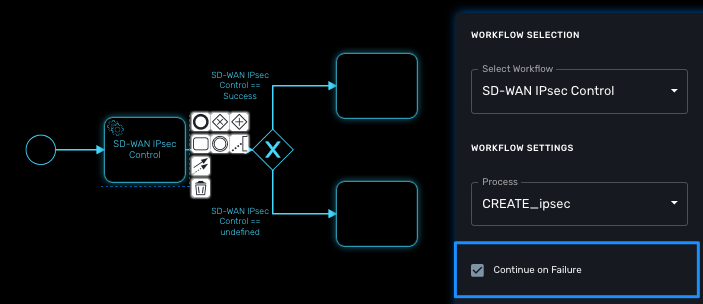

= BPM Editor
:doctype: book
:imagesdir: ./resources/
ifdef::env-github,env-browser[:outfilesuffix: .adoc]
:toc: left
:toclevels: 4 
:source-highlighter: pygments

The BPM editor is a web based UI for designing BPM processes.

== BPM design

To create a new BPM from the developer portal, click on "+ Create" from the swimlane "BPM Library." 

You can also browse through the existing BPM by clicking on "See more."

NOTE: you need to select a sub-tenant to see the BPM.

== Create a new BPM

Click on "Create" to create a new BPM editor.

image:images/bpm_new_editor.png[width=600px]

Use your mouse to add tasks and link them together.

NOTE: A BPM process must have a StartEvent and an EndEvent.

NOTE: Only one executable BPM process can be designed at a time. 

You can save your BPM at anytime and edit it later. When you save you BPM, you need to select a sub-tenant.

NOTE: A BPM is associated to a single sub-tenant.

== Design a BPM process

=== BPMN elements

The {product_name} BPM engine supports the following BPMN elements:

image:images/bpm_start_event.png[] the first element of the BPM process.

image:images/bpm_end_event.png[] indicates the end of the BPM process.

image:images/bpm_task.png[] an executable task that can run workflow processes.

 represents an exclusive decision gateway (or decision tree).

NOTE: Support for more elements will be provided in future link:../release_notes{outfilesuffix}[releases]

=== Exclusive gateway (XOR)

The XOR gateway will let you model a decision in the process.

When the execution arrives at this decision gateway, all outgoing sequence flows are evaluated in the order in which they have been defined. 
The sequence flow whose condition evaluates to ‘true’ is selected for continuing the process.

To configure the gateway, you need to select the outbound link from the gateway, choose the inbound task and configure the condition to trasition to the next BPM task.

.Operator
Select `is` or `is not` as the logical operator

.Status
Select one of `Failed`, `Warning` or `Success` which are related to the link:workflow_editor{outfilesuffix}#lifecycle[3 possible statuses of a process that finished it's execution].

IMPORTANT: as there is no support for an `else` sort of condition, you need to make sure that your decision gateway is considering all prossible statuses of the inbound task. 

== Connecting workflows and processes

Select an executable task to see the list of workflows (based on the sub-tenant selected), then select a process and provide its input parameters.

image:images/bpm_edit.png[width=600px]

== Execution tracking

The BPM engine will start executing the BPM tasks one by one and the status of the current workflow process execution will be updated live in the "LATEST EXECUTIONRESULT" view while the detail of the process execution will be displayed.

image:../../user-guide/resources/images/bpm_execution_tracking.png[width=600px]

== Execution flow control

By default, the BPM execution will stop whenever the associated workflow process execution fails but you may need to make sure that the BPM continues to execute despite the failure. This is typically the case when there is a decision gateway where execution is routed based on the status of the process execution.

To allow the BPM process to continue executing after a workflow process execution fails, you need to edit the BPM task and check "Continue on Failure."

== Parallel execution

Although parallel gateway for modeling concurrency is not supported, it is possible to design a BPM process with basic support for parallel execution.

image:images/bpm_parallel_exec_1.png[]

image:images/bpm_parallel_exec_2.png[]

These 2 use cases are equivalent, the processes will simply run in parallel, independantely, until the end event is reached.

