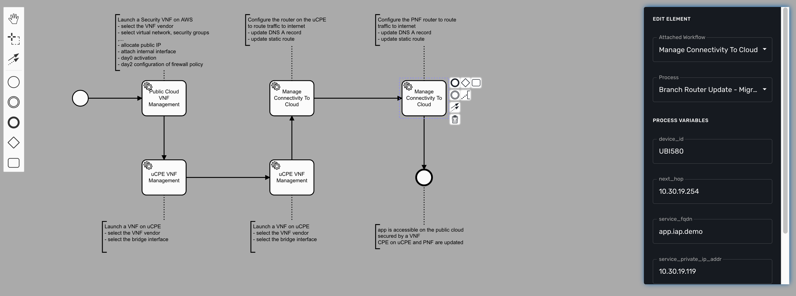

= Getting Started Developing BPM
:imagesdir: ./resources/
ifdef::env-github,env-browser[:outfilesuffix: .adoc]

The BPM (Business Process Modeling) will allow you to design your processes to automate and then execute these processes.

== Uses of BPMN

Business Process modeling is used to communicate a wide variety of information to a wide variety of audiences. 
BPMN is designed to cover many types of modeling and allows the creation of end-to-end Business Processes. 

The structural elements of BPMN allow the viewer to be able to easily differentiate between sections of a BPMN Diagram. 

The {product_name} provides the support for executable BPM Processes. 

With the BPM design console, you can design your BPM and connect the BPM elements to link:../user-guide/automation_workflows{outfilesuffix}[Workflows].

The {product_name} provides a partial support of the link:https://www.omg.org/spec/BPMN/2.0/[BPMN 2.0 specification,window=_blank] and you will be able to use Event and Activities.

.Start Event and End Event
will let you specify the beginning and the end of the process execution.

.Activities: Tasks
Integration Task will allow you to specify the flow of execution of your BPM.

.Text Annotation 
Use text annotation to add some description to your BPM elements.

////
TODO: update for MSA-2.1
////
.Gateway and Intermediate Event
Not supported yes

=== Example

The BPM below is made of 1 start event, 5 integration task and an end event.

Each integration task calls a workflow from the workflows that are associated to the current customer.

== Create or Edit a BPM

To create a new BPM you need to select "Automation" on the left menu. This will list any BPM available for the current customer.

You can either edit a BPM or create a new one from this screen. 
Use you mouse to add elements and link them together.

For each task, you need to select a workflow and one of the process from that workflow. 
The BPM editor will list all the processes defined in a workflow and when the process is selected it will list the variables that are defined in the tasks by the function `list_args`.

IMPORTANT: you should only select workflow processes with the type CREATE.

You can save your BPM design anytime and edit it later.
The BPM files are stored in the repository under `/opt/fmc_repository/Datafiles/<TENANT ID>/<CUSTOMER ID>/bpmn`

== Simple BPM design

TODO

