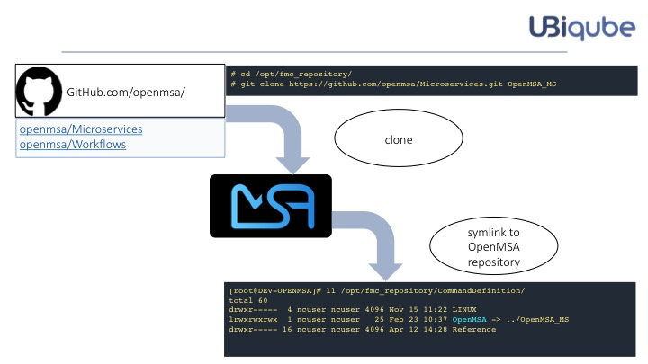
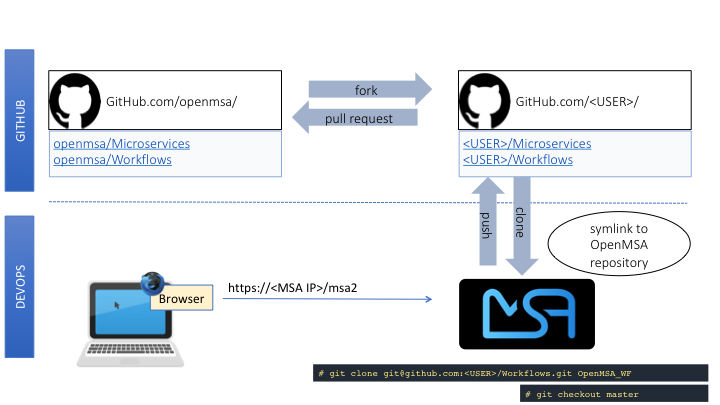
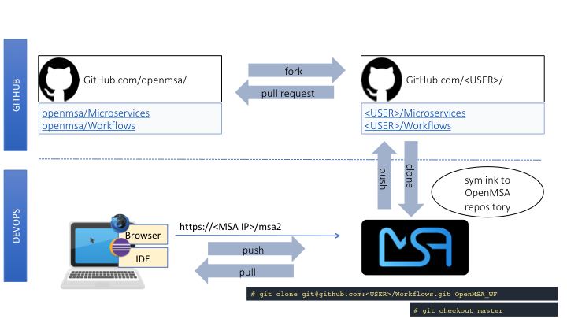

= DevOps Best Practice Guide
:doctype: book
:imagesdir: ./resources/
ifdef::env-github,env-browser[:outfilesuffix: .adoc]
:toc: left
:toclevels: 4 
:source-highlighter: pygments

The {product_name} is a platform for designing and developing network and security automation applications.

The community applications (Microservices, Workflows and Adaptors) are available on https://github.com/openmsa[GitHub]

These applications are located in dedicated GitHub repositories and can be forked and/or cloned from GitHub to your {product_name} development platform.

This page explains in detail how to do this and the associated best practices.

== How to Install the Microservices and the Workflows
=== Overview
As a DevOps engineer, the first step to getting familiar with the {product_name} community code is to:

* Retrieve the code from GitHub
* Install the code on the OpenMSA platform
* Utilize the Microservices and the Workflows

=== Details
Log in to a live {product_name} as root and perform the following actions:

[source]
----
[root@DEV-OPENMSA]# cd /opt/fmc_repository
[root@DEV-OPENMSA]# git clone https://github.com/openmsa/Workflows-Microservices.git OpenMSA
[root@DEV-OPENMSA]# git checkout openmsa-<VERSION>
[root@DEV-OPENMSA]# chown -R ncuser. OpenMSA/
[root@DEV-OPENMSA]# cd CommandDefinition/
[root@DEV-OPENMSA]# ln -s ../OpenMSA/MICROSERVICES/ OpenMSA
[root@DEV-OPENMSA]# cd ..
[root@DEV-OPENMSA]# cd Process/
[root@DEV-OPENMSA]# ln -s ../OpenMSA/WORKFLOWS/ OpenMSA
----
Then browse to the {product_name} GUI, you can start using the microservices and workflows you've installed

[source]
----
Automation > Workflows 
----
and
[source]
----
Integration > Microservices
----

== How to Design/Develop and Contribute to the Community
As a microservice or workflow designer you'll have the opportunity to contribute to the community source code.

The easiest way is to utilize {product_name} as the design tool.  This is the most typical and recommended method. 

. Fork the OpenMSA repository into your GitHub account.
. Clone the repository from your personal GitHub account to your OpenMSA DevOps platform.
. Utilize your favorite browser to use/design/test/update Workflows and Microservices.
. Push the changes to your GitHub account.
. Contribute by submitting pull requests to the OpenMSA community.
. It is possible to use your favorite IDE to ease development of Workflow tasks or Device Adaptors that are in PHP language.

This procedure adds a set of push/pull steps to sync the code from your PC with your {product_name} DevOps platform. 

Design or edit code on your PC and IDE, such as Eclipse or a simple editor with PHP syntax highlighting, then push to the {product_name} platform to use it live.

== How to Install the Adapters
Follow the link to learn how to install the Adapters from the OpenMSA GitHub repository: link:https://github.com/openmsa/Adapters/blob/master/doc/Adaptor_installer.md[Adaptor_installer]

