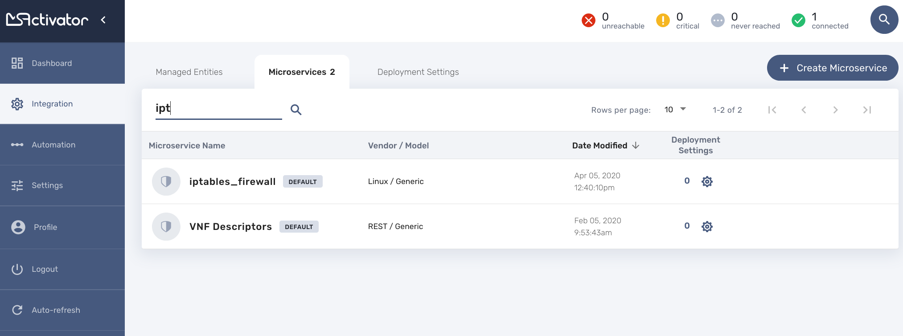

= Microservice Editor
:imagesdir: ./resources/
ifdef::env-github,env-browser[:outfilesuffix: .adoc]
:source-highlighter: pygments

You can use the The Microservice editor UI to create or update a Microservice.

To create or edit a Microservice you can go to the "Integration" section and select the Microservice tab

image:../../user-guide/resources/images/configurations_ms_search.png[]

== Getting started

If you want to directly get stated with a simple exmaple that can run on the mini-lab (see link:../user-guide/quickstart{outfilesuffix}[quickstart]) you can go to this guide: link:microservices_getting_started_developing{outfilesuffix}[Getting Started with Microservices Design]. 

== Microservice Editor Overview

The Microservice console is composed of a vertical menu on the left and a main screen

image:images/microservice_console_information.png[] 

Microservices are vendor specific, the implementations of the functions to create, update, delete or import a managed entity configuration will depend on the managed entity, the type of remote management interface, the format of the configuration, how it is structured,...

It is important to select the correct vendor/model information because this will be used by the link:../user-guide/configuration_deployment_settings{outfilesuffix}[deployment settings] to filter the Microservices that are eligible for selection.

It is also important to select the proper configuration type:

- cli: for devices such as Linux, Cisco IOS, Fortigate,...
- xml: for device with a REST management API (both XML and JSON API are supported)
- netconf: for devices that support Netconf as the management API

The editor UI will adjust based on the configuration type.

WARNING: this setting cannot be changed when editing a Microservice.

Click on "Create Microservice" to create the Microservice.

Once created, you can search for your Microservice in the list and attach it to a link:../user-guide/configuration_deployment_settings{outfilesuffix}[deployment setting], you can also edit it or delete it.

 

NOTE: The easiest way to design a Microservice is to use a test managed entity and do you development in a code-test-fix cycle. This documentation uses the Linux Managed Entity provided by the link:../user-guide/quickstart{outfilesuffix}[mini-lab].

image:images/deployment_setting_linux_mngt.png[]

== Microservice Implementation

The Microservice API is made of several functions that can be implemented. 
It is not mandatory to implement all the functions, this will depend on your requirements and can be done incrementally.

=== The functions Create, Update and Delete

These functions are implemented in PHP Samrty templating language (see link:microservice_smarty_templating{outfilesuffix}[] for more detail)

IMPORTANT: TODO

