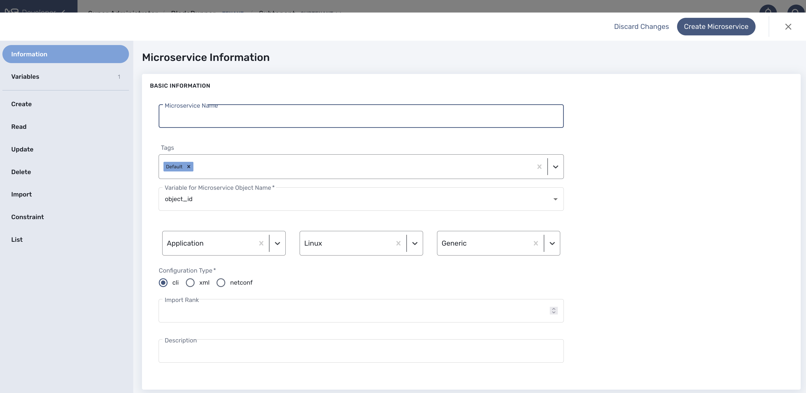

= Microservice Editor
:doctype: book
:imagesdir: ./resources/
ifdef::env-github,env-browser[:outfilesuffix: .adoc]
:toc: left
:toclevels: 4 
:source-highlighter: pygments

You can use the the microservice editor UI to create or update a microservice.

To create or edit a microservice you can go to the "Integration" section and select the Microservice tab

image:../../user-guide/resources/images/configurations_ms_search.png[width=720px]

== Getting started

If you want to directly get stated with a simple exmaple that can run on the mini-lab (see link:../user-guide/quickstart{outfilesuffix}[quickstart]) you can go to this guide: link:microservices_getting_started_developing{outfilesuffix}[Getting Started with Microservices Design]. 

== Microservice editor overview

The microservice console is composed of a vertical menu on the left and a main screen

 

Microservices are vendor specific, the implementations of the functions to create, update, delete or import a managed entity configuration will depend on the managed entity, the type of remote management interface, the format of the configuration, how it is structured,...

It is important to select the correct vendor/model information because this will be used by the link:../user-guide/configuration_deployment_settings{outfilesuffix}[deployment settings] to filter the microservice that are eligible for selection.

It is also important to select the proper configuration type:

- cli: for devices such as Linux, Cisco IOS, Fortigate,...
- xml: for device with a REST management API (both XML and JSON API are supported)
- netconf: for devices that support Netconf as the management API

The editor UI will adjust based on the configuration type.

WARNING: this setting cannot be changed when editing a microservice.

NOTE: this documentation focuses on a CLI based microservice, you can go through this documentation for a building a xml based Microservice: link:microservice_xml_editor{outfilesuffix}[XML Microservice editor].

Click on "Create Microservice" to create the microservice.

NOTE: it is not recommended to change the filename of a microservice after its creation.

Once created, you can search for your microservice in the list and attach it to a link:../user-guide/configuration_deployment_settings{outfilesuffix}[deployment setting], you can also edit it or delete it.

NOTE: The easiest way to design a microservice is to use a managed entity dedicated to testing and follow in a code-test-fix development cycle.
This documentation uses the Linux Managed Entity provided by the link:../user-guide/quickstart{outfilesuffix}[mini-lab].

== CLI microservice implementation

The Microservice API is made of several functions that can be implemented. 
It is not mandatory to implement all the functions, this will depend on your requirements and can be done incrementally.

=== The functions Create, Update and Delete

.Create and Update
These functions are implemented in PHP Smarty templating language (see link:microservice_smarty_templating{outfilesuffix}[] for more detail)

For instance, the CLI commands to create or delete an iptable rule to allow or block a port and an IP are:

----
sudo iptables -A INPUT -p tcp --dport <PORT TO BLOCK> -s <IP TO BLOCK> -j DROP
sudo iptables -A FORWARD -p tcp --dport <PORT TO BLOCK> -s <IP TO BLOCK> -j DROP
----

this is how it would be implemented in the Create function of the Microservice
----
sudo iptables -A INPUT -p tcp --dport {$params.dst_port} -s {$params.src_ip} -j DROP
sudo iptables -A FORWARD -p tcp --dport {$params.dst_port} -s {$params.src_ip}  -j DROP
----

As you can see the parameters are prefixed with `$params.` and this is the reason why the variable editor section will automatically add `$params.` to the variable.

The implementation of the Update will be similar and will of course depend on the CLI syntax.

.Delete
The deletion of the iptables INPUT and FORWARD rules is executed with the CLI command below:

----
sudo iptables -D INPUT -p tcp --dport <PORT TO BLOCK>  -s <IP TO BLOCK>  -j DROP 
sudo iptables -D FORWARD -p tcp --dport <PORT TO BLOCK>  -s <IP TO BLOCK>  -j DROP
---- 

This will be implemented as: 
----
sudo iptables -D INPUT -p tcp --dport {$simple_firewall.$object_id.dst_port} -s {$simple_firewall.$object_id.src_ip} -j DROP
sudo iptables -D FORWARD -p tcp --dport {$simple_firewall.$object_id.dst_port} -s {$simple_firewall.$object_id.src_ip} -j DROP
----

The syntax {$simple_firewall.$object_id.dst_port} provides a way to access the Microservice variable values in the MSActivator configuration database. 

The convention is as follow:
----
{$<MICROSERVICE NAME>.$object_id.<VARIABLE NAME>}
----

In our case:

- MICROSERVICE NAME => simple_firewall 
- VARIABLE NAME => dst_port
- MICROSERVICE NAME is the name of the Microservice file without the .xml extension.

.Example 
simple_firewall.xml => simple_firewall

=== The function Import
The role of the Import command is to import the current device configuration into the {product_name} database.

The implementation of the Import is based on a set of regular expressions that build a parser that will extract the values of the Microservice variables.

The Import is made of 3 parts:

- the command to run on the device (for CLI command based device).
- the configuration parser, implemented with a set of regular expressions. Only the Microservice identifier extractor is mandatory.
- a set of post import operations implemented in Smarty language (https://www.smarty.net/).

This regex will extract the firewall parameter and store them in the database
----
@(?<object_id>\d+)    DROP       tcp  --  (?<src_ip>([0-9]{1,3}\.){3}[0-9]{1,3})[^:]+:(?<dst_port>\d+)@
----

NOTE: the variable `object_id` is a mandatory parameter and will be used to identify the Microservice instance in the database.

=== Testing the microservice
The Microservice is ready to be tested. 

Make sure that you can add and delete a policy rule, that it's reflected on the Linux firewall, and that the parameters are also properly synchronised after a call to Create or Delete.

You can also add some iptables rules manually on the Linux CLI and run a configuration synchronisation to make sure that your manual changes are properly imported.

image:images/microservice_console_create_instance.png[]

