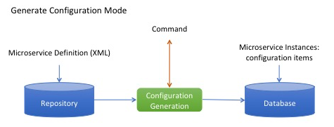
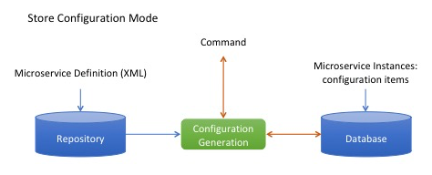
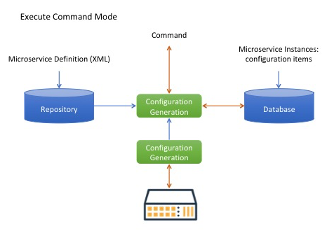

= Microservice Order Command REST API
:toc: left
:toc-title: Content 
:imagesdir: ./resources/
ifdef::env-github,env-browser[:outfilesuffix: .adoc]
:source-highlighter: pygments

== Type of Execution
=== Generate Configuration
This execution type is used to preview the configuration to be generated, before storing it in the database or applying it to the device.

The configuration generated by the command is returned to the caller, no other action is performed.

REST API syntax
[source]
--
POST /ordercommand/get/configuration/{deviceId}/{commandName} 
body : microservice parameters formatted as JSON
--
- deviceId is the ID (long) of the device to manage.
- commandName is the command to apply to the device.
- objectParameters are the JSON formatted list of objects and attributes.

.Example
The call below is using the Microservice vlan.xml to do simple VLAN management on a Cisco Catalyst IOS
[source]
----
curl -u ncroot:NCROOT_PWD  -XPOST http://MSA_IP/ubi-api-rest/ordercommand/get/configuration/311/UPDATE -d '{
	"vlan": {
		"4001": {
			"name": "MyVlan4001",
			"ports": "Fa0\/11",
			"object_id": "4001",
			"status": "active"
		}
	}
}'
----
Where:

MSA_IP is the IP address of {product_name}.

This will return:
[source,json]
----
{
	"commandId": 0,
	"message": "vlan 4002\nname MyVlan4002\n",
	"status": "OK"
}
----

=== Store Configuration
This execution type is used to store the configuration objects in the database.

The configuration generated by the command is returned to the caller, and the generated objects are stored in the database.

Web service syntax:
[source]
----
PUT /ordercommand/store/configuration/{deviceId}/{commandName} 
body : microservice parameters formatted as JSON
----
- deviceId is the ID (long) of the device to manage
- commandName is the command to apply to the device
- objectParameters are the JSON formatted list of objects and attributes.

.Example
The call below is using the Microservice vlan.xml to do simple VLAN management on a Cisco Catalyst IOS

----
curl -u ncroot:NCROOT_PWD  -XPUT http://MSA_IP/ubi-api-rest/ordercommand/store/configuration/311/CREATE -d '{
	"vlan": {
		"4020": {
			"name": "MyVlan4020",
			"ports": "Fa0\/11",
			"object_id": "4020",
			"status": "active"
		}
	}
}'
----
Where:

NCROOT_PWD is the password to the {product_name}.

It will return:
[source,json]
----
{
	"commandId": 0,
	"message": "vlan 4020\nname MyVlan4020\n",
	"status": "OK"
}
----

=== Execute Command
This execution type is used to store the configuration in the database and apply it to the device.

The configuration generated by the command is returned to the caller, the actions are also performed in the database and on the device.

== Executing Commands
Use the following method to trigger OrderCommand (Microservices) methods present at the following URL:
[source]
----
http://MSA_IP/ubi-api-rest/ordercommand/execute/{deviceId}/{commandName}
----

- {deviceId}: is the device sequence number or the numeric part of the {product_name} Device ID
- {commandName}: can take one of the following values:
-- UPDATE
-- IMPORT
-- CREATE
-- DELETE

.Example
[source]
----
curl -u ncroot:NCROOT_PWD  -XPUT http://MSA_IP/ubi-api-rest/ordercommand/execute/311/CREATE -d '{
	"vlan": {
		"4020": {
			"name": "MyVlan4020",
			"ports": "Fa0\/11",
			"object_id": "4020",
			"status": "active"
		}
	}
}'
----

As shown above, the http body contains what's called "object parameters" in general.

=== Root Element
The root element of the JSON body is the Microservice definition identifier. Here, the first JSON element refers to the Microservice definition name.

In the example above it is "syslogd". This is the same string that is used when creating a Microservice definition in the Microservices builder. Hence, in the above case the Microservice was named: "syslogd.xml"

=== Microservice Instance JSON Object
The JSON element at the next level is the object_id of the Microservice instance, in the above case it is: "SyslogConf".

NOTE: the object_id is also passed as an instance variable.

=== Microservice Instance Variables
The third level of JSON elements is the instance variables, represented in a standard name-value pair.

In this case the value of the variable {commandName} is IMPORT (import operation of Microservice) and the http response body will contain the list of Microservice instances.

As an example, let's say we have three instances of "syslogd" Microservices on the device, with instance names:

- SyslogConf
- MSASyslogConf 
- NMSSyslogconf
The response of the import will be the following JSON object, that will be part of http response:

[source,json]
----
{
	"syslogd": {
		"SyslogConf": {
			"object_id": "SyslogConf",
			"syslogd3_status": "enable",
			"syslogd3_port": "514",
			"syslogd3_server_ip": "1.2.2.3"
		},
		"MSASyslogConf": {
			"object_id": "MSASyslogConf",
			"syslogd3_status": "enable",
			"syslogd3_port": "514",
			"syslogd3_server_ip": "2.3.4.5"
		},
		"NMSSyslogconf": {
			"object_id": "NMSSyslogconf",
			"syslogd3_status": "disable",
			"syslogd3_port": "514",
			"syslogd3_server_ip": "7.6.5.4"
		}
	}
}
----

.Getting the Sources
****
The sources of this tutorial are available on GitHub at https://github.com/openmsa/Microservices/tree/master/CISCO/CATALYST_IOS/VLAN

In order to use the Microservice for VLAN management, you need to use vlan.xml and interface.xml because the vlan.xml Microservice references the interface.xml Microservice.
****
