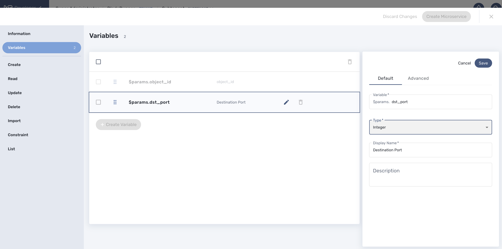

= Microservice Variables
:doctype: book
:imagesdir: ./resources/
ifdef::env-github,env-browser[:outfilesuffix: .adoc]
:toc: left
:toclevels: 4 
:source-highlighter: pygments

//// 
TODO 
////

Variables are usually defined to hold the parameters to be passed to a microservice. For instance, the port and IP address variables to block for a firewall policy. Variables can also be used to display user information that is not meant to be used for configuring the managed entity.

Setting variables is done from the section "Variables" on the microservice editor screen.

When you create a new microservice, the variable object_id, which is mandatory, will be set and cannot be deleted. It can be edited to set its type and other advanced properties.

All variables are referenced with the prefix `$param` which is automatically set in the variable editor screen and when a variable has to be referenced in one of the microservice functions, you need to use the syntax `{$param.your_variable}` (see below for more examples).

By default the type of a variable is String but other types are supported such as Integer, Boolean, Password, IpAddress, ObjectRef,...

== Overview

The variables are usually defined to hold the parameters to be passed to the microservice. For instance, the port and IP address variables to block for a firewall policy. Variables can also be used to display user information that is not meant to be used for configuring the managed entity.

Setting different types for variables will affect the way the microservice end user form, for creating or updating it, will render.

For instance, the type boolean will render the variable with true/false radio buttons.

== Types

.Boolean
This data type accepts a value of true or false. User form renders the decision gateway based which is intended to represent the two truth values of logic and Boolean algebra.

.Integer
This data type represents a numerical value. Integers are whole numbers that are signed (positive numbers).

.String
The default type for a variable. Accepts any value. User form renders as a input field without any specifc validation with regards to the value set.

.Password
This data type represents a multicharacter value that is hidden from plain sight (i.e. the value is represented as asterisks instead of clear text). Password data types are limited to certain sizes and can contain letters, numbers or special symbols.
