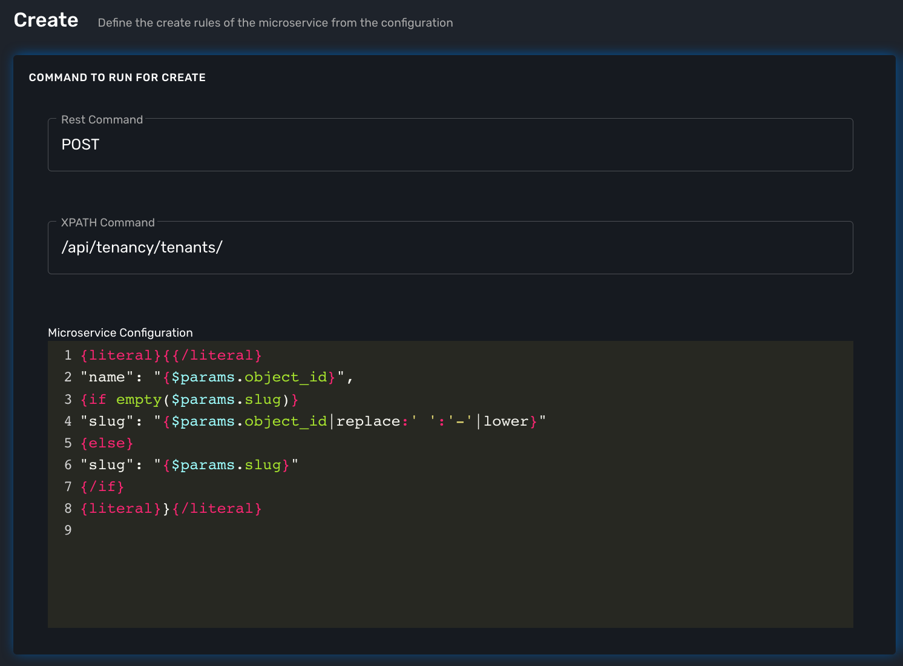
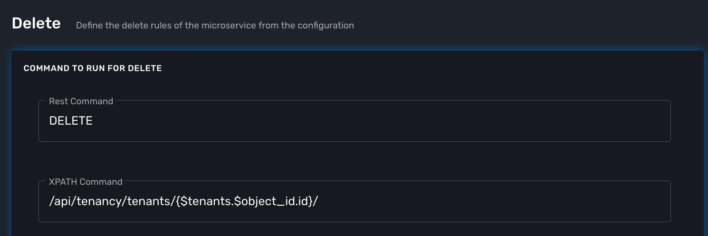

= XML Microservice Editor
:doctype: book
:imagesdir: ./resources/
ifdef::env-github,env-browser[:outfilesuffix: .adoc]
:toc: left
:toclevels: 4 
:source-highlighter: pygments

== Overview

XML microservice are used to manage entities that expose a REST API.

=== The functions Create, Update and Delete

.Create and Update
These functions will call the REST API design to create or update the managed entity configuration.

For instance, the REST API to create a new tenant is

*HTTP Request:* `+/operator/{$prefix}+`

*Method:* `+POST+`
[cols=3*,options="header"]
|===
| Parameter Name
| Type
| Description

| name
| String
| the name of the tenant
|===

*Example:*
[source]
----
POST /ubi-api-rest/operator/TST/name=my_tenant
----

In case you need to pass in a JSON payload with the parameters, the microservice Create will look like this.

.Delete

The main difference between the CLI and REST (Json/XML) Microservice definition is the implementation of the functions Create/Update/...

CLI Microservice definition is covered in this documentation: link:microservice_editor{outfilesuffix}[Microservice Editor].

This documentation uses the link:https://github.com/openmsa/Adaptors/tree/master/adapters/rest_generic[REST Generic adapter] and the {product_name} REST API to illustrate the design of XML Microservice.

== Microservice implementation

Create a new Microservice "msa_tenant" with XML as the configuration type and REST Generic for the vendor and model.

image:images/microservice_editor_xml_information.png[]

In the Import function, we will implement a parser the will list the tenants of the {product_name} with the REST API

*HTTP Request:* `+/ubi-api-rest/lookup/v1/operators+`

*Method:* `+GET+`

TODO

