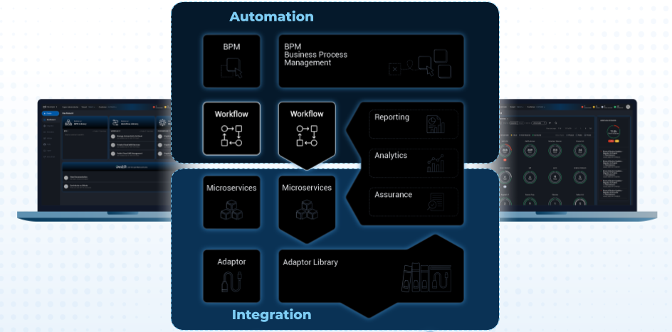

= Workflow Editor
:doctype: book 
:imagesdir: ./resources/
ifdef::env-github,env-browser[:outfilesuffix: .adoc]
:source-highlighter: pygments

The workflow editor is a web based UI tool for designing, developping, testing and releasing automation workflows

With the workflow editor, you can create new workflows or edit existing workflows.

This document explains how to use the editor to design workflow and implement the in PHP or in Python.

The Workflow designer and execution engine are located, in the architecture layer, between the BPM and the Microservice

 

== Overview

A workflow is a automation entity that can be used to automates all sort of simple to complex processes.

A workflow is defined by

- a set of variable that can be used to hold the state of a workflow instance
- a set of processes makes out of tasks that where the execution program is defined

The tasks are scripts that can be implemented either in PHP or in Python.

=== The lifecycle of a workflow

There are 3 main type of workflow processes: 
- CREATE: to execute an automated process and create a new instance of the workflows
- UPDATE: to execute an automated process that will (but it's not mandatory) update the state of the process
- DELETE: to execute an automated process that will also remove the instance of the workflow

[#context]
=== The state of a workflow instance

The variables are used to define the current state of a workflow instance.

For instance, a boolean variable `running` can be set to true or false depending of the state of the managed process.

For each workflow instance, the variable and their values are stored in the database in a context.
This context is accessible in read-write mode anytime in the process tasks in order to store a value of a variable or read a value from a variable.

.Example:
in Python: read a value from the context
[source, python]
----
context = Variables.task_call()
my_name = context['name']
----

set a value in the context
[source, python]
----
context['name'] = my_name
----

The context is persisted in the database and it's value is updated after each task execution.
This is how variable values can be passed, during the execution of a process, from one task to another.
