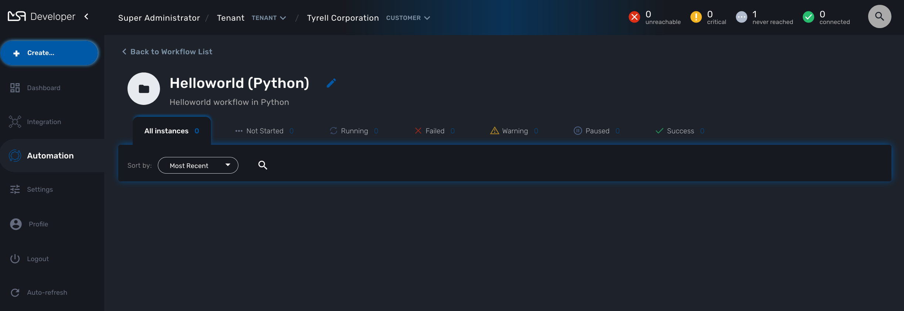

= Getting Started Developing Workflows in Python
:doctype: book
:imagesdir: ./resources/
ifdef::env-github,env-browser[:outfilesuffix: .adoc]
:toc: left
:toclevels: 4 
:source-highlighter: pygments

== Overview

This tutorial walks you through the design and development of your first workflow in Python. 
This tutorial is similar to the link:workflow_getting_started_developing_php{outfilesuffix}[Helloworld example in PHP]

link:../user-guide/automation_workflows{outfilesuffix}[Workflows] can be used to automate a wide variety of tasks and processes, such as:

- Service configuration chaining
- VNF lifecycle management
- Configuration audit and verification
- Automated customer on-boarding
- ...

== The "Hello world" Workflow

As an example, we'll use the "Helloworld" workflow. The "Helloworld" workflow will print a name as IN parameter and will display a message to the user ("Hello NAME").

This workflow is composed of 3 processes: one to create the new instance of the workflow, one to enter the name and print it, and one to delete the instance.

=== Create a New Workflow

From the Developer dashboard click on "+ Create"

In the tab "Information", set a name, a description and set the link:workflow_editor{outfilesuffix}[Workflow variable name] to service_id and save your workflow.

Create a variable "Name" in the tab "Variable".

To start testing your workflow, you need to associate it to a customer. 
Make sure that you have no tenant selected, go to the "Automation" section, you should see your workflow in the list. 

You can use the magnifier to search for it.

Use the link "Add to.." to associate the workflow to a customer.

Select the customer to use for designing and testing the workflow.

Once done, you can select your customer, list its workflows and edit it with the pencil icon.

=== Create the Processes

==== The "create instance" Process

In order to be used, every Workflow should be instantiated first. This is the role of the process with the type "Create".

NOTE: even though for most use cases, a single "CREATE" process is sufficient, it is possible to have several "CREATE" processes to support various ways of creating the Workflow instance (You can relate that to having several object construtor in an OOP language such as Java). 

For this tutorial you will create one process named "create instance" and add one task to this process. This task will simply display a message to the process execution console.

[source, python]
----
from msa_sdk.variables import Variables
from msa_sdk.msa_api import MSA_API

dev_var = Variables()
dev_var.add('name', var_type='String')

context = Variables.task_call(dev_var)

ret = MSA_API.process_content('ENDED', 'workflow initialised', context, True)
print(ret)
----

image:images/workflow_helloworld_add_task_python.png[]

Once done, save the Workflow.

==== The "delete instance" Process

Follow the same steps as in the "create instance" process, but make sure that the type of the process is set to "DELETE", instead of "CREATE".

NOTE: In our case, we only need the instance to be deleted, therefore we don't need a Task to be added to this Process but in a real world use case, your DELETE process will probably take care of removing or cleaning up some parts of your managed system. 

==== The "print message" Process

For the print process, use the process type "UPDATE". 
It will take one parameter that will be used to print your message. 
Use the code below to create a task that will read the name from the user form and print it in the live console.

[source, php]
----
from msa_sdk.variables import Variables
from msa_sdk.msa_api import MSA_API

context = Variables.task_call()
my_name = context['name']

ret = MSA_API.process_content('ENDED', f'Hello {my_name}', context, True)
print(ret)
----

=== Test the Workflow

Use the "+ create instance" action to execute the "create instance" process and create a new instance of your workflow.

A new instance is available and you can execute the process "print message".

The process "print message" will start executing and will executes the tasks sequencially.

The name will be displayed in the task execution status popoup, below the name of the task.
 

