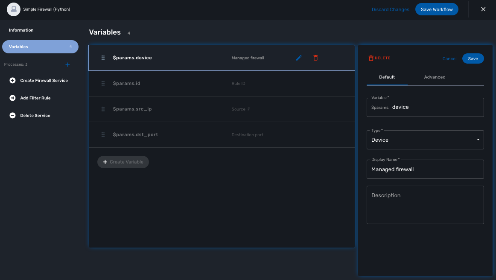
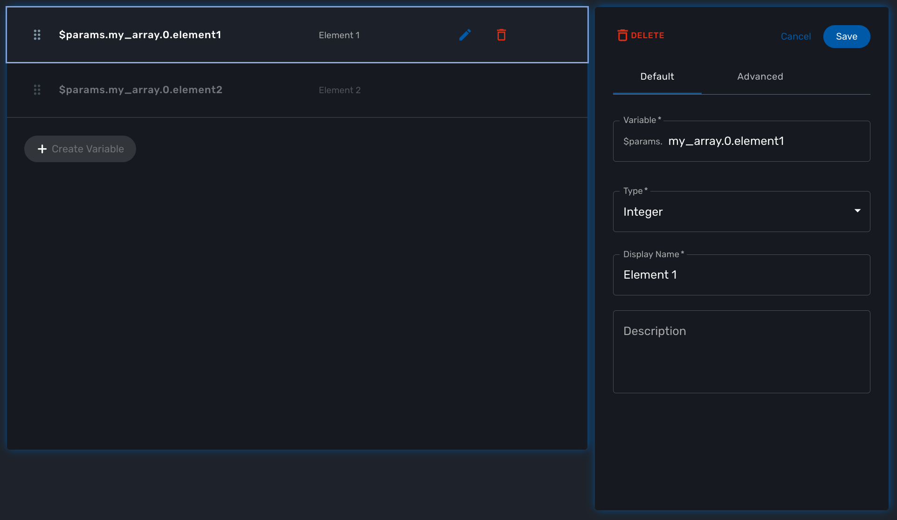

= Workflow Variables
:doctype: book
:imagesdir: ./resources/
ifdef::env-github,env-browser[:outfilesuffix: .adoc]
:toc: left
:toclevels: 4 
:source-highlighter: pygments

//// 
TODO 
////

Variables are usually used to hold the parameters to be passed to a workflow process. For instance, the port and IP address variables to block for a firewall policy. Variables can also be used to display user information that is not meant to be used for any actuall configuration.

Setting variables is done from the section "Variables" on the workflow editor screen.

All variables are referenced with the prefix `$params` which is automatically set in the variable editor screen and when a variable has to be referenced in one of the workflow functions, you need to use the syntax `{$params.your_variable}` (see below for more examples).

By default the type of a variable is String but other types are supported such as Integer, Boolean, Password, IpAddress, ObjectRef,...

== Overview

The variables are usually defined to hold the parameters to be passed to the workflow. For instance, the port and IP address variables to block for a firewall policy. Variables can also be used to display user information that is not meant to be used for configuring the managed entity.

Setting different types for variables will affect the way the workflow end user form, for creating or updating it, will render.

For instance, the type boolean will render the variable with true/false radio buttons.

== Defaut settings

When creating or editing a variable, there are some information that need to be provided in the "Default" section.

image:images/workflow_variables_edit_1.png[workflow_variables_edit_1]

=== Variable

Name of the variable to use in the implementation of the workflow or when calling the REST API.

=== Type

The type of the variable should be one from the list below

==== String

The default type for a variable, it will accepts any value and the UI renders it as a input field without any specifc validation with regards to the value set.

==== Boolean

This data type accepts a value of true or false, the UI will render it as a checkbox.

==== Integer

This data type represents a numerical value, the UI will render it as an input field restricted to integer.

==== Password
NOTE: not supported yet

This data type represents a multicharacter value that is hidden from plain sight (i.e. the value is represented as asterisks instead of clear text). 

==== IPv4 address and mask, IPv6 mask
NOTE: not supported yet

This data type will enforce data validation against IP address formats.

==== Composite
NOTE: not supported yet

The variable type composite provide the means to add control over the behaviour of the workflow user form.

It can be used, for instance, to show/hide part of the form based on the value of another component of the form.

==== Link
NOTE: not supported yet

This type is useful if you wat to display a URL in the user form, for instance to link to some documentation on a web server. It is usually used in read-only mode with the URL set as the default value of the variable

==== File
NOTE: not supported yet

This type is useful for allowing a user to select a file.

==== Auto Increment

This type is used to maintain an incremental counter in within the instances of a workflow for a managed entity. This is useful for managing the object_id.

.Specific advanced parameters
|===
| Increment                                 | an integer to define the increment step
| Start Increment                           | the initial value for the variable
| Workflows sharing the same increment  | a list of workflows that are also using the same variable and need to share a common value.
|===

==== Device 
NOTE: not supported yet

This type is used to allow the user to select a managed entity and pass it's identifier to the implementation of the workflow.

=== Display Name

The display value for the variable name.

=== Description

An optional description of this variable.

== Advanced settings

Depending on the selected type, some advanced parameters may be differ.

[cols=2*,options="header"]
|===

| Setting                   | Description
| Default Value             | the default value that will be used when creating a new workflow instance
| Values for Drop-down      | a list of possible value the user can choose from
| Allow adding free value   | available if some value(s) were provided for drop-down
| Mandatory                 | a value has to be provided for this variable
| Read only variable        | the value cannot be edited
| Section Header            | group some variables in the link:../user-guide/workflows{outfilesuffix}#workflow-console[workflow console] (see link:#group_variables[below]).
| Group variable            | group some variables in the auto-rendered UI for creating or editing a workflow (see link:#group_variables[below].
| Show only in edit view    | hide the variable from the link:../user-guide/workflows{outfilesuffix}#workflow-console[workflow console]
|===

[#group_variables]
=== Group Variables

image:images/workflow_variables_group_4.png[width=300px]

You can group the variables in the workflow console by setting a section header name. The UI will gather the columns under a common header

.Section A and section B
image:images/workflow_variables_group_3.png[width=500px]

It is also possible to group variables to provide a better user experience when creating or editing a workflow and go from a flat view 

image:images/workflow_variables_group_1.png[width=500px]

To a more organised view

.Group A and group B
image:images/workflow_variables_group_2.png[width=500px]

=== Array settings

When you are dealing with variable arrays, these options will let you control the possible actions a user can have over the array.

== Variable arrays

To create a variable array, you need to follow a precise naming convention: `$params.<ARRAY NAME>.0.<ELEMENT NAME>`. The 0, is the separator that will allow the UI and the configuration engine that this variable is an array.

.a variable array with 2 elements

This type of variables should be when extracting configuration with an array variable extractor in the Import function of the workflow.
