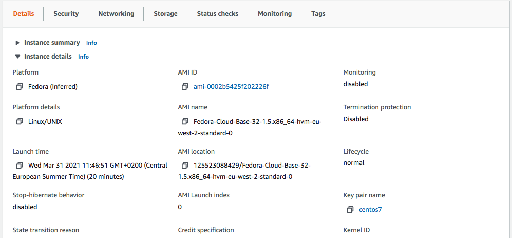

= VNF Orchestration on AWS
:doctype: book
:imagesdir: ./resources/
ifdef::env-github,env-browser[:outfilesuffix: .adoc]
:toc: left
:toclevels: 4 
:source-highlighter: pygments

== Overview

This documentation will drive you throught the process of installing and using a workflow for automating the deployment of a VNF on AWS public cloud infrastructure. 

It's an example this is simple enough to be installed and used in a lab environment without too much configuration, but complex enough to show how the {product_name} can be used for such a thing as VNF orchaestration automation in a public cloud.

video::_sY1r-Q9Y6I[youtube,width=600px,height=360] 

=== About soure code

The source code for the workflows and microservices referenced, is freely available in the OpenMSA github repository:

- Public cloud AWS workflow: https://github.com/openmsa/Workflows/tree/master/Public_Cloud/AWS/Instance_Management
- AWS microservices: https://github.com/openmsa/Microservices/tree/master/AWS/Generic
- Fortigate microservices: https://github.com/openmsa/Microservices/tree/master/FORTINET/FortigateVA

== Prerequisites

=== AWS Account

To be able to run this demo, you need to have an AWS account with sufficient privileges to create some IAM user and policy.

=== AWS IAM configuration

The demo uses microservices, adapter and workflows to automate the orchestration of the VNF on AWS. They rely on the AWS API to execute and will require an authentication.

To run this demo use case, you need to make sure that you have an AWS IAM (Identity and Access Management) user with an access key.
The access key will be used when creating the AWS link:../user-guide/managed_entities{outfilesuffix}[managed entity] (see below) 

==== IAM policy

The use should be granted with a policy that allows enough privileges to manage EC2 and VPC programmatically. If you can, the easiest way to acheive this is to allow all EC2 and VPC actions.

If this is not possible then here is the list of actions to be allowed to use the link:https://github.com/openmsa/Workflows[workflow] and the link:https://github.com/openmsa/Microservices[microservices] available on github.com/openmsa

- DescribeNetworkInterfaces
- AttachNetworkInterface
- CreateNetworkInterface
- DeleteNetworkInterface
- DescribeInstances
- TerminateInstances
- DescribeSecurityGroups
- CreateSecurityGroup
- DeleteSecurityGroup
- DescribeAddresses
- DescribeSubnets
- DescribeVpcs
- CreateVpc
- DeleteVpc
- RunInstances
- RebootInstances
- WaitUntilInstanceRunning
- StartInstances
- StopInstances
- CreateTags

NOTE: if you extend the workflow or the microservices to provide a larger functional coverage, you may have to update the policy for accessing the AWS REST API.

==== IAM user

Create a user and attach the policy to this user

You will also need an access key for this user in order to make secure REST API call from the {$product_name}

[#me_creation]
== Create a managed entity for an AWS region

The VNF automation workflow for AWS uses both microservices and direct AWS API calls to implement the VNF orchestration. In both cases AWS user credentials (the access key created up above) is required. These credentials are provided at the AWS managed entity creation form in the username and user password fields.

When creating the AWS managed entity, make sure that you select AWS / Generic for the Vendor / Model.

The AWS managed entity is also used to define the link:https://docs.aws.amazon.com/AWSEC2/latest/UserGuide/using-regions-availability-zones.html#concepts-regions[region] where the VNF will run. The region information is set at the managed entity creation form, in the hostname field. The region should be the one set in the AWS console URL.

The last information for managing an AWS region with the {$product_name} is the management IP address. The management IP address can be found by taking the hostname from the AWS console URL from your browser.

.Example:
with the AWS console URL https://eu-west-2.console.aws.amazon.com/ec2/v2/home?region=eu-west-2 the region is *eu-west-2* and the IP address is *52.94.48.109*
----
$ ping eu-west-2.console.aws.amazon.com
PING console.eu-west-2.amazonaws.com (52.94.48.109): 56 data bytes
64 bytes from 52.94.48.109: icmp_seq=0 ttl=236 time=20.272 ms
----

Create and activate the link:../user-guide/managed_entities{outfilesuffix}[managed entity]. The activation, implemented by the link:https://github.com/openmsa/Adapters/tree/2.2.0GA/adapters/aws_generic[AWS Generic adapter] will try to call some REST API during its process. A successful activation ensure that the information provided during the creation of the managed entity are correct and that the credentials are valid by calling 2 API: `DescribeInstances` and `DescribeVpcs`:

[source, php]
----
public function do_connect()
  {
    $network = get_network_profile();
    $sd = &$network->SD;
    $this->key = $this->sd_login_entry;
    $this->secret = $this->sd_passwd_entry;
    $this->region = $sd->SD_HOSTNAME;
    
    $cmd = "Aws\Ec2\Ec2Client#describeInstances#{ \"MaxResults\" : 5 }";
    $result = $this->sendexpectone(__FILE__ . ':' . __LINE__, $cmd, "");    

    $cmd = "Aws\Ec2\Ec2Client#describeVpcs#";
    $result = $this->sendexpectone(__FILE__ . ':' . __LINE__, $cmd, "");    
----

NOTE: the activation phase will *not* check that the AWS user is authorized for every AWS API needed for the orchestration (see list above).

== Create a deployment setting to use microservices

Create a new deployment setting in your current subtenant, set the vendor to AWS and select the microservices below:

- Instances
- Network Interfaces
- Security Groups
- Subnet
- VPC

These microservices are installed as part of the link:../user-guide/quickstart{outfilesuffix}#step2[quickstart] setup. 

Add your managed entity to the deployment setting and verify that you can use the microservices by browsing to the managed entity page and selecting the tab "Configure". 

Use the action "Synchronize with Managed Entity" to import the AWS "config". On a new, blank AWS region, you should at least see the default VPC.

NOTE: if the synchronisation seems to have no effect, you can try to activate the managed entity once more and run the synchronisation again.

== The VNF orchestration automation workflow.

At this stage you have a managed entity with a selected vendor and a deployment setting with the microservices required for the workflow.

The workflow is provided as part of the link:quickstart{outfilesuffix}#step2[quickstart] setup and is available in the UI, under "Automation / Workflows", as "VNF Orchestration". To use it, if you haven't done so, you need to link:../user-guide/automation_workflows{outfilesuffix}#use[add it to a subtenant].

=== Overview of the workflow

The workflow will provide the processes to start a instance of a firewall (Fortinet Fortigate) on AWS, create the managed entity for this instance and provide the link:https://github.com/openmsa/Microservices/tree/master/FORTINET/FortigateVA[microservices] to do some simple firewall policy management.

The microservices for managing policies on Fortigate are installed in you mini lab during the setup of the quickstart. They are the ones available from Github.

The Workflow has 3 main processes:

.New service
This process will ask the user to select an AWS managed entity, this is the way to select the region where the VNF will be created and to pass the AWS credentials to the workflow. 

The execution of this process will trigger a microservice synchronization and will populate the workflow variables typed `Microservice Reference` with the actual values from the AWS region (ex: the list of subnets or security groups)

.Launch Instance
This process will ask the user to select data such as the AMI image ID, the subnet, the security group to use for the VM instanciation... then it will automatically launch the AWS instance, create and activate a new managed entity with a set of microservices.

The result is a ready-to-use managed entity for firewall management with a Fortigate

=== Setup a deployment setting for Fortigate firewall management

During the deployment of the VNF, the workflow will create a managed entity on the {$product_name}, activate it and (optionally) attach it to a deployment setting with some link:https://github.com/openmsa/Microservices/tree/master/FORTINET/FortigateVA[microservices].

For that to work you have to create a new deployment setting with the microservices you want to use with the fortigate.

When you create the deployment setting, make sure that you set the link:../user-guide/configuration_deployment_settings{outfilesuffix}#external_ref[external reference]. For instance, you can set it to `FGT_FW`.

Then attach the following microservices:

- Address Group
- Address Object
- Destination NAT
- Firewall Policy
- Interface
- Service Group
- Service Object
- Source NAT
- Static Route
- Syslogd
- Timezone
- User Interface

=== Use the workflow

==== New Service

First you need execute the process `New Service` to select an AWS region where to create the AWS instance and to create a new workflow instance.

==== Launch Instance

Then, select the process `Launch Instance`. This will open a user form where you will be able to configure the AWS instance:

//// 
TODO : update images when UI works 
////

Some fields will require a value to be set:

.Image ID: 
This is the AMI ID for a Fortigate instance. The ID ami-0b1bed84cc40437e7 is for a FortiGate-VM64 6.0.6 in the region eu-west-2 (London). If you have created a managed entity for another region, you will have to find the correct AMI ID from the AWS marketplace

.Instance Type:
This is where you select the CPU/Memory/Storage combination for your instance. You can try with one of the type listed but you can also use another one as long as it's supported by the AMI and the region

.Security Group and Subnet ID
These 2 variables are typed as `Microservice Reference`, they will provide a list of values to choose from. These lists are populated by the corresponding microservices.

This ensures that the values the user chooses are correct for the AWS region

IMPORTANT: you still need to make sure that the security group and the subnet are part of the same VPC otherwise the creation of the instance will fail

.Login
The instance default login: `admin` for a Fortigate.

.New Password 
The process will assign a new password to the VNF, make sure that the new password is compatible with the VNF vendor policy (at least 8 character for fortigate)

.Subtenant Id:
Select the subtenant where the managed entity will be created

.Manufacturer and Model ID
Use 17 / 15102617 to create a managed entity Fortinet / Fortigate. This managed entity will use the link:https://github.com/openmsa/Adapters/tree/master/adapters/fortigate/conf[adapter from github]

.Deployment Setting Reference
Set the value to the deployment setting that you have prepared with the Fortigate microservices. This field is optional, if you leave it empty, the managed entity will not have the microservice associated but this is something that can be done manually later.

==== Run

When all parameters are set, click `Run` to execute the process

On the AWS EC2 console you can see the instance initializing.

While on the workflow console you can see the process executing its task one after the other

It takes around 5 minutes to finish

On the AWS EC2 console you can see the instance ready to be used

A new managed entity is now available in the subtenant that you selected. The name of the managed entity is set to the AWS instance id and it's management IP address is the one allocated by EC2.

The managed entity is also associated to the deployment setting that you created above in this documentation.
This allows you to directly get started with some firewall policy management on the Fortigate.

