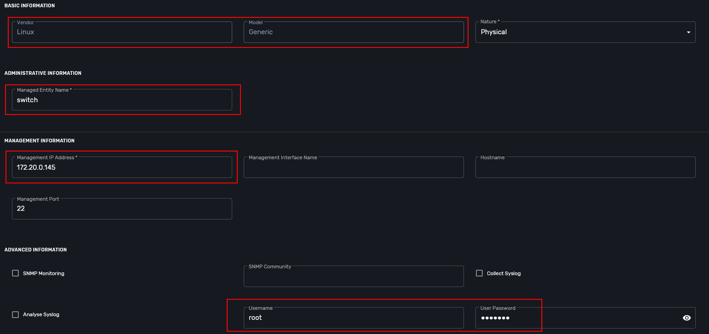

= VLAN Simple Use Case
:doctype: book
:imagesdir: ./resources/
ifdef::env-github,env-browser[:outfilesuffix: .adoc]
:toc: left
:toclevels: 4 
:source-highlighter: pygments

== History - investigation, predicaments, fails

I was always interested in how to make a layer2-switch or a router out of a bare Linux machine.

Since I've started my career as a network engineer I became familiar with various network products and vendors, learned their advantages and disadvantages.

Once I put my hands on a Linux machine and understood immediately the power of open source software, it was a moment when I began developing idea around classical open source Ethernet switch.

Simple architecture assumes the presence of next components:

 - user-friendly interface (in 2010 it was stack of Apache, JavaScript and PHP)

 - database (requires planning of the database itself: tables, relations etc.)

 - core-engine (set of scripts to reinvigorate my idea)

...well then you need to think of how to maintain that solution (backups, updates, scaling)

OK, primarily I was a network engineer and didn't know much about listed functions, to be honest I didn't even know about that simple architecture.

So, as you can see I'd started this path of learning and investigation long before I created this list :-)

Long story short I created this solution, spent lots of time and efforts (mainly discovering best practices), and my solution was far away from production like system.

I was clearly seeing what to do next, how to improve that, but there was question I should answer - is it worth it?

Don't worry, I made this  Ethernet switch to gain experience basically.

Today I found something awesome, something that allows me concentrate on my idea rather than database architecture or user interface.

Something that will help me to create open source and maintainable Ethernet switch and has a user friendly interface.

== Architecture

Let's start from VLAN definition:
A virtual LAN (VLAN) is any broadcast domain that is partitioned and isolated in a computer network at the data link layer (OSI layer 2) [https://en.wikipedia.org/wiki/Virtual_LAN] broadcast domain that is partitioned and isolated in a computer network.

Linux bridge perfectly fits this requirement.

Let's do it in the next way: one broadcast domain - one bridge.

== Sandbox environment

To make a lightweight playground topology I decided to use Docker containers, simple and cross-platform.

=== Switch
we need next packages on the top of basic OS (Alpine):

- openssh (to take control over the SWITCH)
- bash (to make some stdout parsing)
- tcpdump (to capture/verify tagged traffic)

Docker image is 14.4MB (alpine:3.12).

=== Hosts
we need several hosts connected to the SWITCH to test different VLAN scenarios.

- pc_01, pc_02 -  placed in default_vlan, traffic from hosts untagged.

- pc_03 - placed in 100 vlan, traffic from host untagged.

- pc_04 - placed in 200 vlan, traffic from host tagged.

packages required:

        openssh (to take control over)

Docker image is 11.7MB (alpine:3.12).
Scenarios

Default state:

- pc_01, pc_02 - can ping each other, placed in default_vlan
- pc_03 is not reachable, placed in 100 vlan
- pc_03 is not reachable, placed in 200 vlan, encapsulates frames with 200 802.1q tag.

Set pc_01 in vlan 100 and ping pc_03

Set pc_01 in vlan 200(untagged) and ping pc_04

ensure with TCP dump packets are encapsulated/de-encapsulated properly

Set pc_01 in vlan 200(tagged) and ping pc04

NOTE: pc_01 should have tagging enabled

=== Dockerfile and docker-compose files

- link:https://github.com/ubiqube/quickstart/blob/master/lab/vlan/docker-compose.yml[docker-compose.yml]
- link:https://github.com/ubiqube/quickstart/blob/master/lab/vlan/pc.dockerfile[pc.dockerfile]
- link:https://github.com/ubiqube/quickstart/blob/master/lab/vlan/switch.dockerfile[switch.dockerfile]

=== Workarounds

.pc.sh
Workaround to assing certain network addresses to interfaces randomized by docker.

consider "eht0" interface one that have 172.20.0.x address assigned by Docker DHCP.

consider "eht1" interface one that have 10.222.x.y address assigned by Docker DHCP.

[source, shell]
----
# WORKAROUND FOR UNCERTAIN DOCKER INTERFACE ORDER
eth0=$(ifconfig | grep -B1 "inet addr:172.20.0." | awk '$1!="inet" && $1!="--" {print $1}')
eth1=$(ifconfig | grep -B1 "inet addr:10.222." | awk '$1!="inet" && $1!="--" {print $1}')
----

[source, shell]
----
# CHANGE IP ADDRESS TO THE PROPER ONE AND MAKE 4th MACHINE TAGGED
NUM=`echo $HOSTNAME | grep -E -o '[1-9]'`
IPADDR=`ifconfig $eth1 | grep 'inet addr' | cut -d: -f2 | awk '{print $1}'`
NEW_IPADDR='10.222.222.1'$NUM'/24'
----

NOTE: complete pc.sh - available link:https://github.com/ubiqube/quickstart/blob/master/lab/vlan/pc.sh[here]

For PC_04 here is 802.1q tagging enabling, for PC_01,PC_02,PC_03 - untagged:

[source, shell]
----
if [ $NUM = '4' ]; then
    ip a d $IPADDR dev $eth1
    ip link add link $eth1 name $eth1.200 type vlan id 200
    ip a a $NEW_IPADDR dev $eth1.200
    iplink set $eth1.200 up
else
    ip a d $IPADDR dev $eth1
    ip a a $NEW_IPADDR dev $eth1
fi
----

.switch.sh

Assigns certain network addresses to interfaces randomized by docker.

Creates tagged interface faced on PC_04.

Uses bridge-utils to create network broadcast domains (VLANs).

NOTE: complete switch.sh - available link:https://github.com/ubiqube/quickstart/blob/master/lab/vlan/switch.sh[here]

So, at this step we are good to go and should be ready to start managing the switch.

== Framework

MSActivator is an Integrated Automation Platform (IAP) framework for creating user-friendly, easy, maintainable and scalable solutions...

=== Step 1: register the switch

=== Step 2: control the bridge

Then we need to think of how to control the bridge utils - microservices will help us much:

Here you can see representation of the next output

[source, shell]
----
    switch:~# ip a
    1: lo: <LOOPBACK,UP,LOWER_UP> mtu 65536 qdisc noqueue state UNKNOWN qlen 1000
        link/loopback 00:00:00:00:00:00 brd 00:00:00:00:00:00
        inet 127.0.0.1/8 scope host lo
           valid_lft forever preferred_lft forever
    2: eth3.200@eth3: <BROADCAST,MULTICAST,UP,LOWER_UP100> mtu 1500 qdisc noqueue master vlan_200 state UP qlen 1000
        link/ether 02:42:0a:de:e1:0a brd ff:ff:ff:ff:ff:ff
    3: vlan_default: <BROADCAST,MULTICAST,UP,LOWER_UP> mtu 1500 qdisc noqueue state UP qlen 1000
        link/ether 02:42:0a:de:de:0a brd ff:ff:ff:ff:ff:ff
    4: vlan_100: <BROADCAST,MULTICAST,UP,LOWER_UP> mtu 1500 qdisc noqueue state UP qlen 1000
        link/ether 02:42:0a:de:e0:0a brd ff:ff:ff:ff:ff:ff
    5: vlan_200: <BROADCAST,MULTICAST,UP,LOWER_UP> mtu 1500 qdisc noqueue state UP qlen 1000
        link/ether 02:42:0a:de:e1:0a brd ff:ff:ff:ff:ff:ff
    36: eth0@if37: <BROADCAST,MULTICAST,UP,LOWER_UP100,M-DOWN> mtu 1500 qdisc noqueue master vlan_default state UP
        link/ether 02:42:0a:de:de:0a brd ff:ff:ff:ff:ff:ff
        inet 10.222.222.10/24 brd 10.222.222.255 scope global eth0
           valid_lft forever preferred_lft forever
    48: eth1@if49: <BROADCAST,MULTICAST,UP,LOWER_UP100,M-DOWN> mtu 1500 qdisc noqueue master vlan_default state UP
        link/ether 02:42:0a:de:df:0a brd ff:ff:ff:ff:ff:ff
        inet 10.222.223.10/24 brd 10.222.223.255 scope global eth1
           valid_lft forever preferred_lft forever
    50: eth2@if51: <BROADCAST,MULTICAST,UP,LOWER_UP100,M-DOWN> mtu 1500 qdisc noqueue master vlan_100 state UP
        link/ether 02:42:0a:de:e0:0a brd ff:ff:ff:ff:ff:ff
        inet 10.222.224.10/24 brd 10.222.224.255 scope global eth2
           valid_lft forever preferred_lft forever
    54: eth3@if55: <BROADCAST,MULTICAST,UP,LOWER_UP100,M-DOWN> mtu 1500 qdisc noqueue master vlan_default state UP
        link/ether 02:42:0a:de:e1:0a brd ff:ff:ff:ff:ff:ff
        inet 10.222.225.10/24 brd 10.222.225.255 scope global eth3
           valid_lft forever preferred_lft forever
    56: eth4@if57: <BROADCAST,MULTICAST,UP,LOWER_UP,M-DOWN> mtu 1500 qdisc noqueue state UP
        link/ether 02:42:ac:14:00:91 brd ff:ff:ff:ff:ff:ff
        inet 172.20.0.145/24 brd 172.20.0.255 scope global eth4
           valid_lft forever preferred_lft forever
----

There are three interfaces which names starts with "vlan", so there is a naming convention I've chosen and I'm following, to retrieve and parse that data we just need to specify appropriate command and regexp - that is all!

According to CRUD/I model we can CREATE interface (bridge), DELETE or UPDATE, let's see how it works:

=== Step 3: CREATE

=== Step 4: DELETE

=== Step 5: UPDATE

=== Step 6: use the UI

Finally we can see it works from UI.

For example change VLAN 100 to DOWN state:

=== Step 6: Now we can control the processes

- create bridge
- delete bridge
- enable bridge
- disable bridge

=== Step 7: control host-faced (end-user) network interfaces

Let's think how to control host-faced (end-user) network interfaces. 

I suggest creating one more microservice, these feature should be decoupled in order to be reused and simplified.

That is how I want to see it:

And that is how it actually looks:

[source, shell]
----
switch:~# brctl show
bridge name             bridge id               STP enabled     interfaces
vlan_200                8000.02420adee10a       no              eth3.200
vlan_100                8000.02420adee00a       no              eth2
vlan_default            8000.02420adede0a       no              eth0
                                                                eth1
                                                                eth3
----                                                                

==== CREATE

More complicated than first Microservice but still simple and much more flexible because it handles user input exceptions:

All you need to do is just to list command as you are in CLI and replace certain values with variables

==== DELETE

    
=== UPDATE
presumes several options:

- switch interface from one vlan to other: (untagged > untagged), (tagged > untagged), (tagged > untagged)
- option (tagged > tagged) handles by DELETE (or/and) CREATE method, You create one more bridge and assign port to it.

    
Finally here is an example from UI

