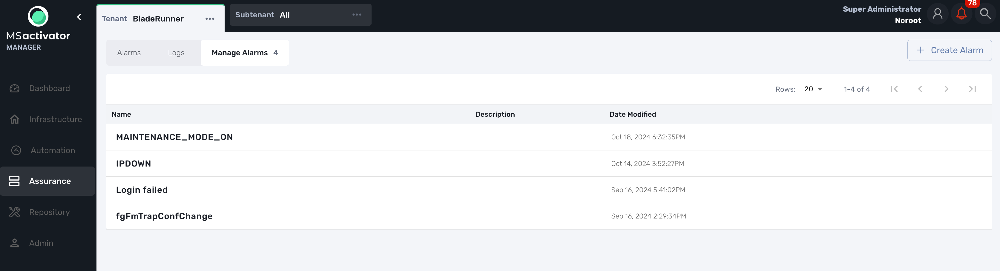
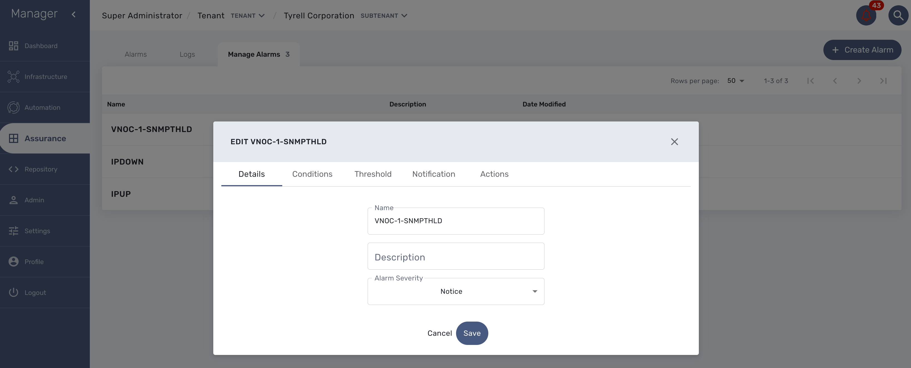

= Assurance
:doctype: book
:imagesdir: ./resources/
ifdef::env-github,env-browser[:outfilesuffix: .adoc]
:toc: left
:toclevels: 4 

The {product_name} provides an assurance module for collecting network events and managing alarms

All the events sent by the managed or monitored entities are collected, indexed and analyzed centrally.

== Log analytics

=== Overview

The {product_name} can collect, index and store events received from the managed entities. 
Once indexed, the logs are fully searchable from the user interface.

The diagram below shows the syslog processing steps from the device to Elasticsearch. 

image:images/assurance_log_analysis_event_flow.png[width=1000px]

=== Search logs

Event stored in the ELasticsearch is searchable from MSA UI,  to search, you have to be connected as Privilege Adminstration and then go to Alarms tab as show in the below screen shot

== Alarm management

=== Overview

The alarm management module is based on the detection of events which internal (VNOC), SNMP thresholds, or sylogs sent by the managed devices and collected by the {product_name}. 
Alarm management is designed to provide email notifications to customers or managers or administrator

The detection of events relies on rules configured at the super administrator level. 

Rule management is available for the super administrator (ncroot). The rules are defined globally and can be modified by the SOC team. 

The infrasctructure management team (IT/SOC/NOC) can modify the setting of the notifications on a per-event and/or per-subtenant basis. 
The rules are executed on a periodic basis (the period frequency can be configured) and alarms are generated whenever a rule matches.

=== Manage alarm rules
Alarm Rule can be created from the Manage Alarms tab, as show in the below screen shot. 
Alarm Name shoud be Unique across the SOC and it should not contain space. 

=== Create or edit an alarm 

Alarm creation contains Four sections below

==== Detail

in this section we need to provide a name for the alarm

==== Conditions

This is where we define the matching rules for the alarm.

.Conditions string 
A text that will used to search in the incoming logs to generate alarm.
 
.Subtenant 
If selected, the logs search for the alarm triggering will be considered only for the Manage Entity that belongs to that subtenant
 
.Manage entity
If selected, the logs search for the alarm triggering will be considered only for that Manage Entity
 
.Severity levels
If selected,  alarm wil be triggered for the logs with only those Severities

==== Threshold 

Define the number of events and the time period to consider for triggering one alarm 

==== Notification

Select the link:tenants_and_users{outfilesuffix}[user roles] that will be notified by email when an alarm is raised.

==== Actions

Choose the workflow and the process to execute when an alarm is triggered.

=== SMTP configuration

For Alarms to be notified as Email, we need a proper SMTP relay to be configured. Below is the command you can use to change the SMTP ip address, where 10.30.19.99 is your SMTP ip address.
  
----
$ sudo docker-compose exec msa_sms sed -i -e 's/UBI_SMTP_IPADDR.*/UBI_SMTP_IPADDR=10.30.19.99/g' /opt/configurator/vars.ubiqube.net.ctx
$ sudo docker-compose exec msa_sms sed -i -e 's/UBI_MAIL_SMTP.*/UBI_SMTP_IPADDR=10.30.19.99/g' /opt/configurator/vars.ubiqube.net.ctx
$ sudo docker-compose exec msa_sms /etc/init.d/ubi-sms restart
----

