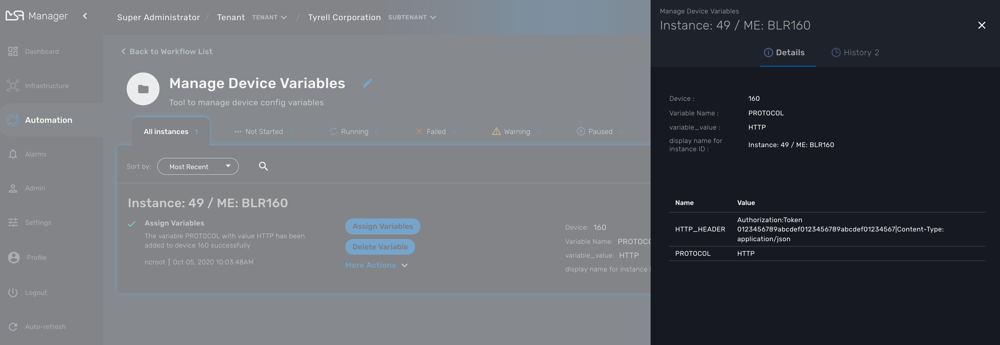

= Workflows: utilities
:doctype: book
:imagesdir: ./resources/
ifdef::env-github,env-browser[:outfilesuffix: .adoc]
:toc: left
:toclevels: 4 

Useful workflows to use as is of to extend based on your needs

[#conf_variables]
== Managed entities configuration variables

link:managed_entities{outfilesuffix}#me_conf_var[Configuration variables] can be associated to any managed entity to add custom configuration to a managed entity.

In order to managed these configuration variables, you can use the workflow link:https://github.com/openmsa/Workflows/tree/master/Utils/Manage_Device_Conf_Variables[Manage Device Variables].

The workflow provices a simple UI to create/update/delete and list the configuation variables associated to a managed entity.

To use it, execute the process *Init* to select a managed entity. *Init* will also read the database for any existing configuration variable.

Once created, you can use the workflow instance to manage the configuration variables.

IMPORTANT: If you use the process *Delete*, the workflow instance will be deleted but it *will not* delete the configuration variables

The workflow instance is identified by it's ID associated to the managed entity ID (ex: `Instance: 49 / ME: BLR160` in the screenshot above)
