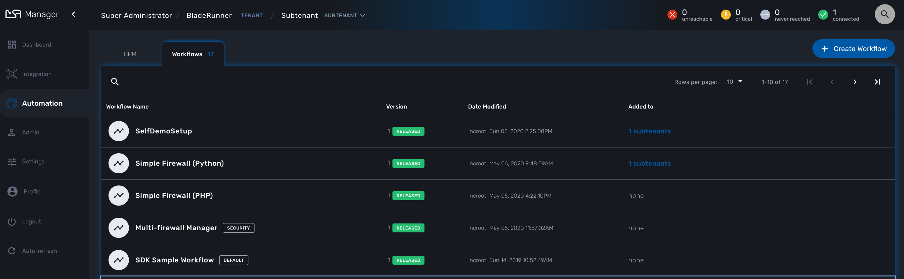
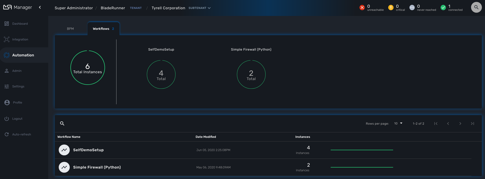
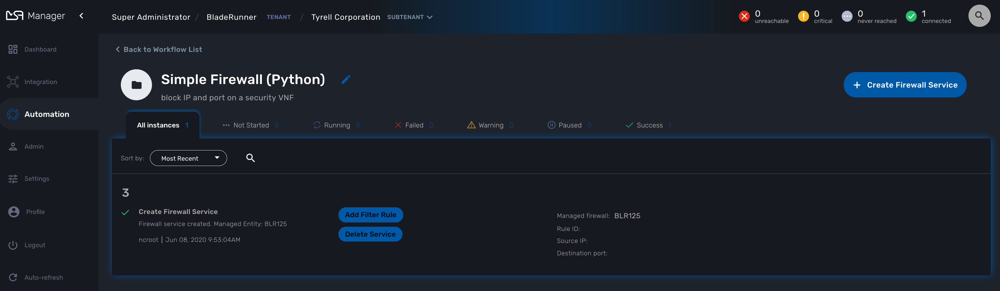
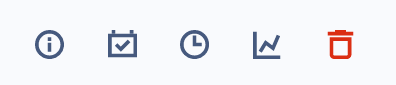
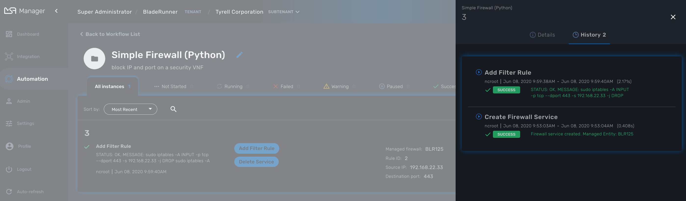
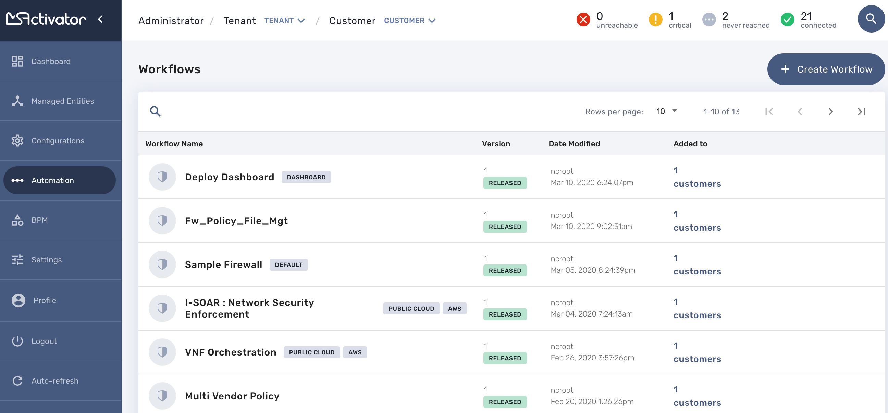

= Workflows
:doctype: book
:imagesdir: ./resources/
ifdef::env-github,env-browser[:outfilesuffix: .adoc]

Workflows allows the creation and management of complex processes.

== Overview
This guide explains how to list workflows, select them and run them.

A Workflow is composed of:

- A collection of processes, where each process is composed of a set of executable tasks.
- A list of variables that will be stored in the database and are holding the state of a Workflow instance.
- Some administrative information used to manage the service in the service console.

== Workflow Selection

In order to use a Workflow, it has first to be associated to a customer.
To do so, you need to select a WF from the list and click on "Add to..."

This will open a dialog popup where customer will able to select the customer to add/remote to/from a Workflow

== Workflow Use

To run a Workflow you must first select a customer from the customer selection list at the top of the screen.

This will display the customer management dashboard for the Workflows.
This dashboard shows the overall status of process execution.

To use a Workflow, you have select it from the list at the bottom of the screen. 
This will open a screen with the list of the Workflow instance and actions to create new instances, update or delete existing ones.

=== Create a Workflow Instance and Run Processes

Use the action on the top right to create a new instance of the Workflow, select the actions available on an instance to call the processes available for this Workflow.

==== Instance Lifecycle

Before you can start using a Workflow, you need to create a new 'instance' of the Workflow. (For programmers, this is akin to thinking of using a class to create an object instance in Object-Oriented Programming, or OOP).

The action on the top right will create a new instance and open a user form where you will be able to provide some parameters related to the creation of the instance (you can think of this as passing a parameter to the constructor in OOP). 
The form may not always require parameters (this would be the case of the default constructor in OOP).

The example below shows a user form with some network related information, scroll down and click on "Run" to execute the instance creation process.

image:images/automation_workflow_instance_create_form.png[]

Once an instance is created, you can execute any process available to either update the instance state and run some automated task or delete the process instance. 
The process to delete an instance can also execute some automated tasks before removing the instance from the list.

.Example
A typical example of a Workflow lifecycle is the one to mangage VNF on a cloud:

- CREATE process: the user provide the VNF specific parameters and the process execute to create the VNF on the cloud, create and activate the Managed Entity on the {product_name}.
- UPDATE processes: the user can ask for scale up/down or configuration changes of the VNF
- DELETE process: the VNF is removed as well as any related resources

=== Get Information about Workflow Instance Status

The list of Workflow instances can be filtered by the status of the execution of their processes:

- All Instances: list all the instances
- Running: list the instances that have a process running
- Failed: list the instances that had a process execution failure
- Warning: list the instances where the last process execution ended with a warning
- Success: list the instances where the last process execution ended succesfully

The status of a process and how a process can end with one of the possible statuses is defined by the process, in the tasks.

For each instance, a toolbar is available when you hover your mouse over it: 

Each icon will give you some information about the instance:

image:images/automation_workflow_instance_info.png[]

- Details: lists the Workflow variable and their values. This is the state of the instance.
- History: lists the processes that were executed. For each process you can get the user that triggered the execution, the start and end time, the status of the execution.

The history will let you audit the process past executions and access all their the details.

////
TODO uncomment when WF guide is available

For more details on the process status you can read the guide link:../developer-guide/workflow_getting_started_developing{outfilesuffix}[getting started with workflows]

////

////
== Workflow Engine Overview
TODO
The Workflow engine is responsible for 

////

== Access Rights

As privileged administrator (ncroot) or administrator, you have access to multiple tenants and their related customers.
You can list the workflows that are in used (ie. associated to a customer) by clicking on the "Automation" link on the left menu.

As a manager you will only be able to select the customer in your tenant.

== Workflow Design

Workflow design is explained in the link:../developer-guide/index{outfilesuffix}[developer guide]
