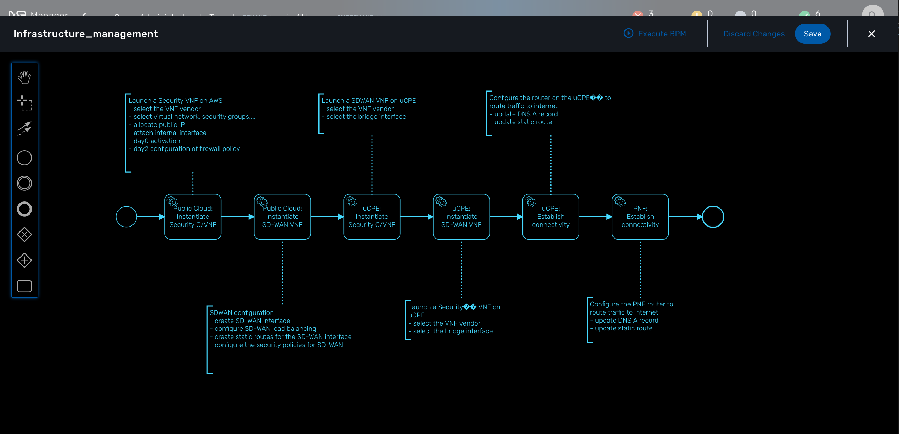
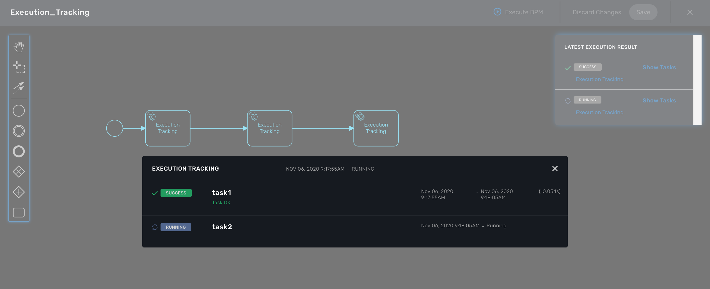

= BPM
:doctype: book
:imagesdir: ./resources/
ifdef::env-github,env-browser[:outfilesuffix: .adoc]
:toc: left
:toclevels: 4 

The integrated BPM engine can be accessed by clicking the "Automation" link in the left menu. 

You need to select a customer to see the list of BPM available because BPM defintion are customer specific.

Select a BPM from the list and click on it name to open it.

Click on "Execute BPM" to execute the BPM process. The BPM engine will start executing the BPM tasks one by one and the status of the current workflow process execution will be updated live in the "LATEST EXECUTIONRESULT" view while the detail of the process execution will be displayed.

NOTE: We advise you to keep the BPM execution screen open until the end of the BPM process. If you close the screen, the process will still run in the background and you can track the execution of the workflows from the "Automation" > "Workflows" page but you won't be able to recover the BPM execution screen.

NOTE: click link:../developer-guide/bpm_editor{outfilesuffix}[here] if you are interested in learning about BPM design
