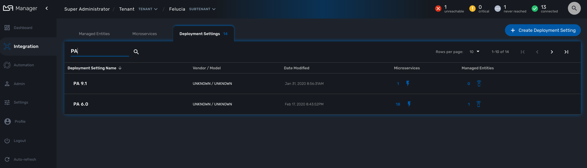

= Deployment Settings
:doctype: book
:imagesdir: ./resources/
ifdef::env-github,env-browser[:outfilesuffix: .adoc]

Deployment Settings will allow you to build your configurations and apply them to you Managed Entities. 
Deployment Settings will also ease any change to your configurations: you can add/remove a template or a link:configuration_microservices{outfilesuffix}[microservice] and be assured that the change will be applied to every existing managed entities.

== Deployment Settings Use

You can view the Deployment Settings by clicking the "Configuration" link on the left menu and select the tab "Deployment Settings"

This page shows the list of deployment settings, sortable and searchable by name.

A Deployment setting acts as the intermediary between a set of Managed Entities and a set of Microservices

[ditaa]
....
            +-----------------+n                                                                     
            | Microservices   |------\    1                                                          
            +-----------------+       -----+----------------------+ 1      n +------------------+    
                                           | Deployment Settings  |----------| Managed Entities |    
            +-----------------+       -----+----------------------+          +------------------+    
            |    Templates    |------/     1                                                          
            +-----------------+n                                                                                                    
.... 

== Access Control

As Deployment Settings are customer specific, in order to view the existing Deployment Settings you need first to select a customer. Once selected as shown below, this enables the user to change those settings appropriately.

image:images/deployment_settings.png[Deployment Settings]

You can search Deployment Settings or order them as appropriate by clicking on the field headings such as Deployment Setting Name, Vendor / Model or Date Modified.

