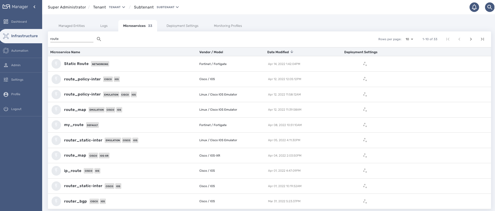
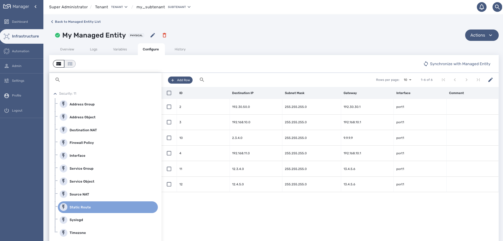

= Microservices
:doctype: book
:imagesdir: ./resources/
ifdef::env-github,env-browser[:outfilesuffix: .adoc]
:toc: left
:toclevels: 4 

The {product_name} microservices engine is designed as a networking object-based programming language.

Any feature of any device can be managed with one or more Microservices. 
Microservice designers define the variables and implement the Create | Read | Update | Delete method.

This open and agile approach is required to provide an abstraction layer on top of any device from core to the edge.

The implementation of the functions allows us to create, update, or delete sub-parts of the configuration on our managed devices. 
A function can also be implemented to import the device configuration into the {product_name} configuration database.

Microservices can be used to manage a wide variety of services on numerous types of devices, such as network equipment, virtualization infrastructure managers, or even Linux servers.

Any feature of any device may be managed with microservices. The microservice developer defines the variables and the Create | Read | Update | Delete methods. 

Microservices can be designed graphically in the {product_name} developer portal. 

Scripting is not mandatory but link:../developer-guide/microservice_smarty_templating{outfilesuffix}[simple programming functions], such as conditional statements, loops, and variable assignments, are available to incorporate advanced function behaviors.

== Use microservice

The list of Microservices available can be viewed by clicking on the "Integration" link from the left menu.

image:images/configurations_me_list_admin.png[Microservice List]

From this page you can search for a named microservice by using the search field with the magnifier icon.

From this page you can create or edit microservices - which is part of microservice design (cf. section below).

The list of microservice can be sorted by name, vendor/model, modification date and number of deployment settings.

In order to use a Microservice, it has to be associated to a link:managed_entities{outfilesuffix}[managed entity] via a link:configuration_deployment_settings{outfilesuffix}[deployment setting].

[#microservice-console]
== Microservice console

With the microservice console you will be able to use the microservices associated to a managed entity to configure the managed entity.

You can access the console by selecting the managed entity you want to configure and going to the tab "Configure"

For more documentation about configuring managed entities with the microservices, you can go to this link:managed_entities{outfilesuffix}[documentation].

== Microservice Design

Microservice design is documented in the link:../developer-guide/index{outfilesuffix}[Developer Guide]

