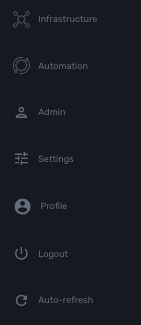

= Getting Started with the MSA
:toc: left
:toc-title: Content 
:imagesdir: ./resources/
ifdef::env-github,env-browser[:outfilesuffix: .adoc]

== Why a new UX?

*Vision*: MSA is to enable a ‘DevOps-ready’ Orchestration Continuum to enable the design of integrated automation solutions across the entire tech ecosystem (datacenter to WAN, edge computing and IoT: all wrapped with security).

*Target users*:  SI engineers developing (DevOps) end-to-end solutions for their business customers, or end-users managing the lifecycle of their infrastructure or the services they are deploying (Telco, Cloud, MSSP, etc.).

A UX reflecting the above wide variety of technical scenarios and user experiences was required and it became obvious that *this redesign was becoming a critical enabler of this strategy*.

== MSA-2.0 NG Key Requirements

. A UX providing two navigation environments to address both types of user:
* *A developer-centric environment*.
* *An end-user-centric environment*.
. A UX structure in line with our modular MSActivator marketing (microservices, workflows, etc.) for consistency and greater concept adoption.
. A universal taxonomy (naming and tagging) that would appeal to the entire ecosystem no matter the domain or the use case (datacenter, services, security, networking, wireless, wireline, IoT, etc.).
. A modern UX where navigation experience matters more than feature list.
. A UX that connects to our community for greater intel and information-sharing among all of the MSActivator users and developers.
. A UX that becomes an evergreen platform, which we continue to improve over time, making our ‘agility by design’ claim a tangible reality for our customers and partners.
. A UX that becomes a strategic module of the MSActivator strategy as we head towards 5G, edge computing and IoT. 

== Terminology

The 7 terms that define the tree of the MSA navigation:

[frame=none]
|===

|
 1. Managed Entities (used to be devices)
 
 2. Configurations (category for config profiles and Microservices)
 
 3. Automation (category for Workflow)
 
 4. Assurance (category for Monitoring, Logs, Alarms)
 
 5. Repository
 
 6. Admin (for users etc.)
 
 7. Settings | 
|===

