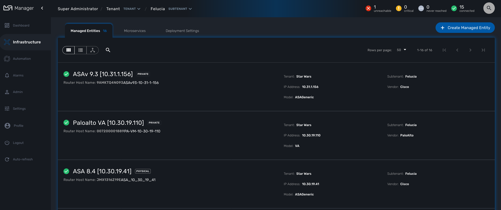
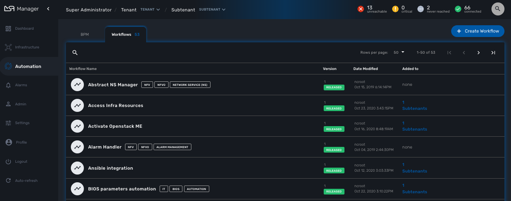
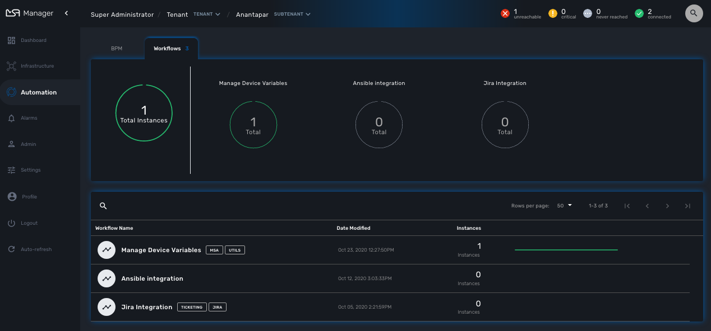
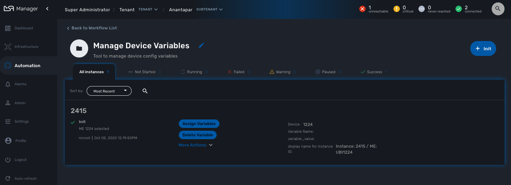
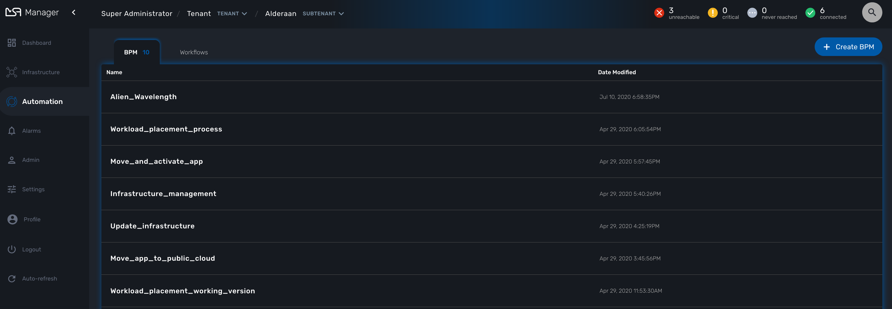
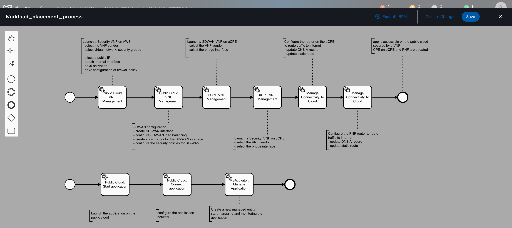

= GUI Overview
:doctype: book
:imagesdir: ./resources/
ifdef::env-github,env-browser[:outfilesuffix: .adoc]
:toc: left
:toclevels: 4 

The {product_name} provides a web based UI split into 2 distinct spaces: a manager space and a developer space. 
Each space is designed to match the specific requirements of manager and developer and at the same time provide a consistent user experience. 

== Administrator and manager dashboard

When you login as an administrator or a manager, the following dashboard is displayed

image:images/gui_admin_dashboard.png[Admin Dashboard,width=700px]

[cols="20,80",stripes=even,width=80%]
|===
| Dashboard 		| Display graphs to show the overall status of customer Managed Entities and Workflow Instance.
					  Each of the graphs represents the status of the managed entities for the named customer.
| Infrastructure	| Shows the managed entities, microservices and deployment settings. 						
| Automation		| Shows the Workflows and BPMs that are in use and available for use in the system.
| Alarms			| For showing and searching the event and managing the alarms
| Admin				| Manage tenants and users. 
| Settings			| For license activation and product version
| Auto-refresh 		| Set an overall refresh period in seconds.
|===

=== Status graphs

image:images/dashboard_status_graph_overview.png[alt=Status Graph, width=150px]

This graph is very convenient, as it represents a lot of data in a small area.
Firstly, it is made up of three concentric circles:
- The outer circle represents physical entities.
- The middle circle represents public entities.
- The inner circle represents private entities.

To further illustrate this, a legend is provided on the dashboard to explain each circle purpose:

image:images/dashboard_status_graph_nature.png[alt=Status Graph Nature, width=350px]

NOTE: It is up to the {product_name} to decide the type of each entity when they are configuring that entity entry.

Finally, the number in the center of the circles is the total number of managed entities associated with that customer.
If you click on any of those status graphs, you then see a pop-up table containing the same details but in a matrix like so:

=== Filters, sorts and search

On the administrator dashboard, there are a number of filter, sort, and search options available to help you organise and view your data.

image:images/dashboard_filter_sort_search.png[alt=Filters Sorts Search, width=500px]

- The first icon allows you to switch between the status graphs and the compact list view of the customer entity status.
- The second icon enables you to switch between a tenant view and a customer view.  When clicked, the status graphs will display the tenant-level status data, which aggregates all of the customers in each tenancy into a single graph per tenancy.  We will discuss customer and tenancy navigation further in the Navigating via tenant and customer filters section.
- The third icon enables you to sort the status graph lists using the following options.
- Finally, the last icon is a magnifying glass that can be used to search for a specific tenant or customer within the list being displayed.

=== Navigation

==== How to select tenants and Subtenants
A central part of the navigation in {product_name} is understanding the tenant and customer that are selected.  
You can use the drop-downs on the top of the navigation to choose which tenant and customer you want to filter the lists of managed entities, microservices, and workflows by.

image:images/admin_dashboard_tenant-customer_selection.png[alt=Tenant and Customer Selection, width=500px]

NOTE: Note that the Role-Based Access Controls (RBAC) will affect what tenants and customers will be available to you.  For example, if your account only has access to one tenant, you won't even have the option to select a different tenant.

.Filters persistence
One very important topic to note is that your tenant and filter selection are persistent between screens.  

.Searching for subtenants and tenants
One useful feature in the tenant and customer selection drop-downs is the ability to search for an item by name.
Auto-completion type ahead is also supported.

.Clearing filters
To clear your selected tenant or customer filters, you simply click on the X button in the drop-down beside the name.

.Searching for managed entities
To perform a system-wide search for a managed entity by name, you should firstly click on the search icon in the top-right corner of the screen.
Auto-completion type ahead is also supported.

NOTE: One important point to remember about performing a managed entity search is that when you search for an entity, you are implicitly selecting the tenant that entity belongs to in the main filter drop-downs. 

== Infrastructure

=== Managed entities
To see the list of managed entities, click on the "Integration" link in the left menu

image:images/me_detailed_list.png[alt=Managed Entities Detailed List,width=7	00px]

On that screen, you can use the list view toggle button to switch to a compacted view of the managed entities list.
You can also adjust the amount of entities displayed on each page

Finally, on this screen you can also perform a simple search of the managed entity you are looking for by its name.

TIP: See also - link:managed_entities{outfilesuffix}[this documentation] for a detailed documentation on managed entities

=== Microservice
To see the list of microservices, click on the link "Infrastructure" in the left menu.

=== Deployment settings

You can view the list of deployment settings by clicking on the tab "Deployment Settings".

This screen will let you build your deployment settings by selecting microservice .

You will also be able to select the Managed Entities you wish to apply you configuration service on.

TIP: See also - link:microservices{outfilesuffix}[Microservices] for a detailed documentation on managed entities

== Automation

=== Workflows
To see the list of workflows select the "Automation" link in the left menu.

By default, if you are connected as a manager or an administrator you will see the list of Workflows that are associated to the subtenant you are managing 

.List of all the workflows available
 

If you select a subtenant, the list will be filtered by the selected subtenant's workflows and you will see the process execution status of the workflow instances.

.List of all the workflows available for a subtenant
 

To see the workflow instance for a subtenant, you can click on the Workflow name

.List of the workflows instances available for a subtenant
 

From this screen you can start using the existing instances or create a new instance for the current Workflow.

=== BPMs
To see the list of Business Processes select the "Automation" link in the left menu

 

You can select a BPM by clicking on a name in the list and start working on your BPM.

 

== Developer Dashboard

The developer dashboard in {product_name} is available when you chose to login as a developer.  
On this dashboard, one of the first things you will notice is the three vertical swimlanes:

image:images/gui_dev_dashboard.png[alt=Developer Dashboard,width=700px]

The three swimlanes match the three main layers of the {product_name} framework, namely:

=== Workflow library
This is where you can develop new workflows for your application.  
In {product_name}, workflows can be written in either PHP or Python.  
A workflow is a series of tasks that you can develop to carry out any set of complex tasks that you wish to automate via our orchestration engine.

=== Microservices library
This is where you can develop new microservices for your application.  
In {product_name}, a microservice is a way to wrap commands (Create/Read/Update/Delete/Import) into a service, that can be invoked with a workflow or even from outside {product_name} via our REST API.  
The microservices are typically used for managing the configuration of managed entities in an abstracted, vendor-neutral way.

=== Adapters library
This is where you can develop new adaptors for your application, or import existing ones.  
The adaptors are used to connect to managed entities from {product_name}, regardless of the network protocols supported by the entity in question.  
If an adaptor is not already available for your entity vendor in the library, a new one can be developed.

