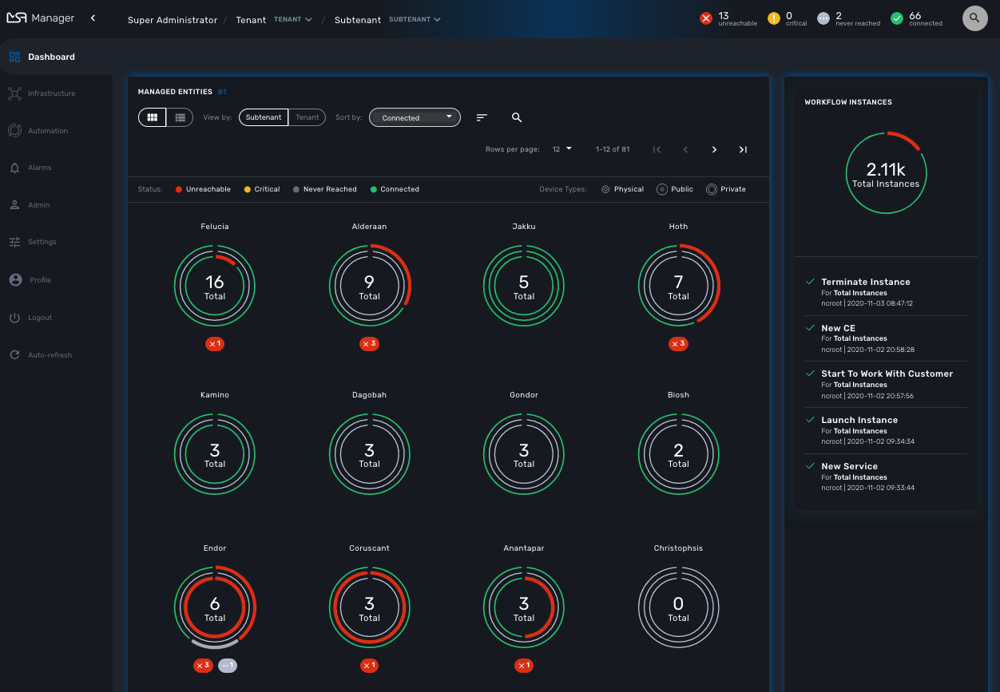

= GUI Overview
:toc: left
:toc-title: Content 
:imagesdir: ./resources/
ifdef::env-github,env-browser[:outfilesuffix: .adoc]

== GUI Overview

When you login as an administrator or a manager, the following dashboard is displayed

[stripes=even]
|===
| Alarms 			| Shows the alarms raised by the Assurance system (coming soon)
| Dashboard 		| Show the overall status of customer Managed Entities and Workflow Instance 
| Managed Entities	| Shows the entities managed by this MSA. Entities can be network element such as routers or firewalls, cloud or uCPE management system,...
| Configurations	| Shows the Microservices and the Templates available in the MSA Repository. 
						
					  Configuration will also show the Deployement Settings created in this MSA
| Automation		| Shows the Workflows that are in use and available for use in the system. You can add a Workflow to a Customer from there.
| BPM				| Create or Load you business process modelings, integrate them with Workflows and Microservices.
| Assurance			| View the Monitoring configuration. You can edit Monitoring configuration and configure your own SNMP based KPI to monitor your Managed Entities. (coming soon)
| Repository		| Organise your files such as Templates, Microservices, Workflows, Firmware images in the Repository. (coming soon)
| Settings			| For license activation and system health status. (coming soon)
| Auto-refresh 		| Set an overall refresh period in seconds.
|===

IMPORTANT: TODO

port doc from 

- http://confluence.ubiqube.com/display/MSAC/The+administrator+dashboard
- http://confluence.ubiqube.com/display/MSAC/The+developer+dashboard
- http://confluence.ubiqube.com/display/MSAC/Navigating+via+tenant+and+customer+filters
- http://confluence.ubiqube.com/display/MSAC/Understanding+the+different+personas

NOTE: https://docs.fortinet.com/document/fortimanager/6.2.3/administration-guide/537284/gui-overview can be used as an example for GUI doc