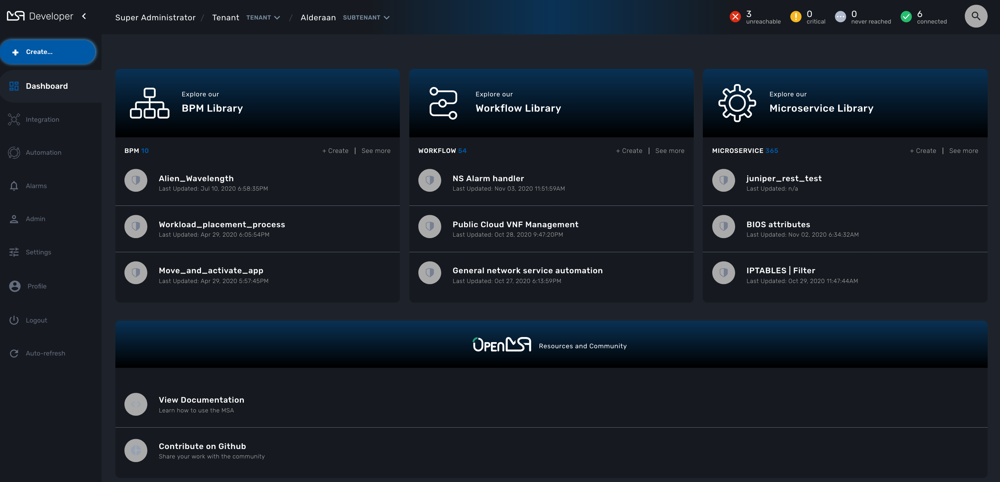

= GUI Overview
:doctype: book
:toc: left
:toc-title: Content 
:imagesdir: ./resources/
ifdef::env-github,env-browser[:outfilesuffix: .adoc]

////

IMPORTANT: TODO

////

== GUI Overview

=== Administrator and Manager Dashboard

When you login as an administrator or a manager, the following dashboard is displayed

image:images/gui_admin_dashboard.png[Admin Dashboard]

[stripes=even]
|===
| Dashboard 		| Display graphs to show the overall status of customer Managed Entities and Workflow Instance.
					  Each of the graphs represents the status of the managed entities for the named customer.
| Alarms 			| Shows the alarms raised by the Assurance system (coming soon)
| Managed Entities	| Shows the entities managed by this MSA. Entities can be network element such as routers or firewalls, cloud or uCPE management system,...
| Configurations	| Shows the Microservices and the Templates available in the MSA Repository. 
						
					  Configuration will also show the Deployement Settings created in this MSA
| Automation		| Shows the Workflows that are in use and available for use in the system. You can add a Workflow to a Customer from there.
| BPM				| Create or Load you business process modelings, integrate them with Workflows and Microservices.
| Assurance			| View the Monitoring configuration. You can edit Monitoring configuration and configure your own SNMP based KPI to monitor your Managed Entities. (coming soon)
| Repository		| Organise your files such as Templates, Microservices, Workflows, Firmware images in the Repository. (coming soon)
| Settings			| For license activation and system health status. (coming soon)
| Auto-refresh 		| Set an overall refresh period in seconds.
|===

==== Status Graphes

image:images/dashboard_status_graph_overview.png[alt=Status Graph, width=200px]

This graph is very convenient, as it represents a lot of data in a small area.
Firstly, it is made up of three concentric circles:
- The outer circle represents physical entities.
- The middle circle represents public entities.
- The inner circle represents private entities.

To further illustrate this, a legend is provided on the dashboard to explain each circle purpose:

image:images/dashboard_status_graph_nature.png[alt=Status Graph Nature, width=350px]

NOTE: It is up to the MSActivator to decide the type of each entity when they are configuring that entity entry.

Finally, the number in the center of the circles is the total number of managed entities associated with that customer.
If you click on any of those status graphs, you then see a pop-up table containing the same details but in a matrix like so:

image:images/dashboard_status_graph_details.png[alt=Status Graph Details, width=400px]

==== Filters, Sorts and Search

On the administrator dashboard, there are a number of filter, sort, and search options available to help you organise and view your data.

- The first icon allows you to switch between the status graphs and the compact list view of the customer entity status.
- The second icon enables you to switch between a tenant view and a customer view.  When clicked, the status graphs will display the tenant-level status data, which aggregates all of the customers in each tenancy into a single graph per tenancy.  We will discuss customer and tenancy navigation further in the Navigating via tenant and customer filters section.
- The third icon enables you to sort the status graph lists using the following options.
- Finally, the last icon is a magnifying glass that can be used to search for a specific tenant or customer within the list being displayed.

==== Navigation

===== Selecting Tenants and Customers
A central part of the navigation in MSA is understanding the tenant and customer that are selected.  
You can use the drop-downs on the top of the navigation to choose which tenant and customer you want to filter the lists of managed entities, microservices, and workflows by.

NOTE: Note that the Role-Based Access Controls (RBAC) will affect what tenants and customers will be available to you.  For example, if your account only has access to one tenant, you won't even have the option to select a different tenant.

.Filters Persistence
One very important topic to note is that your tenant and filter selection are persistent between screens.  

.Searching for Customers and Tenants
One useful feature in the tenant and customer selection drop-downs is the ability to search for an item by name.
Auto-completion type ahead is also supported.

.Clearing Filters
To clear your selected tenant or customer filters, you simply click on the X button in the drop-down beside the name.

.Searching for Managed Entities
To perform a system-wide search for a managed entity by name, you should firstly click on the search icon in the top-right corner of the screen.
Auto-completion type ahead is also supported.

NOTE: One important point to remember about performing a managed entity search is that when you search for an entity, you are implicitly selecting the tenant that entity belongs to in the main filter drop-downs. 

=== Managed Entities
To see the list of managed entities, click on the "Managed Entities" link in the left menu

image:images/me_detailed_list.png[alt=Managed Entities Detailed List]

On that screen, you can use the list view toggle button to switch to a compacted view of the managed entities list.
You can also adjust the amount of entities displayed on each page

Finally, on this screen you can also perform a simple search of the managed entity you are looking for by its name.

TIP: See also - link:managed_entities{outfilesuffix}[Managed Entities] for a detailed documentation on managed entities

////

Developer Dashboard doc
TODO: update for next release

////

=== Developer Dashboard
NOTE: This feature is not available yet. 
The documentaion below aims at providing a early preview. 

The developer dashboard in MSActivator 2.0 is available when you chose to login as a developer.  On this dashboard, one of the first things you will notice is the three vertical swimlanes:

The three swimlanes match the three main layers of the MSActivator framework, namely:

.Workflow Library
This is where you can develop new workflows for your application.  In MSActivator, workflows can be written in either PHP or Python.  A workflow is a series of tasks that you can develop to carry out any set of complex tasks that you wish to automate via our orchestration engine.

.Microservices Library
This is where you can develop new microservices for you application.  
In MSActivator, a microservice is a way to wrap commands (Create/Read/Update/Delete/Import) into a service, that can be invoked with a workflow or even from outside MSActivator via our REST API.  
The microservices are typically used for managing the configuration of managed entities in an abstracted, vendor-neutral way.

.Adaptor Library
This is where you can develop new adaptors for your application, or import existing ones.  
The adaptors are used to connect to managed entities from MSActivator, regardless of the network protocols supported by the entity in question.  
If an adaptor is not already available for your entity vendor in the library, a new one can be developed.

port doc from 

- http://confluence.ubiqube.com/display/MSAC/The+administrator+dashboard
- http://confluence.ubiqube.com/display/MSAC/The+developer+dashboard
- http://confluence.ubiqube.com/display/MSAC/Navigating+via+tenant+and+customer+filters
- http://confluence.ubiqube.com/display/MSAC/Understanding+the+different+personas

NOTE: https://docs.fortinet.com/document/fortimanager/6.2.3/administration-guide/537284/gui-overview can be used as an example for GUI doc