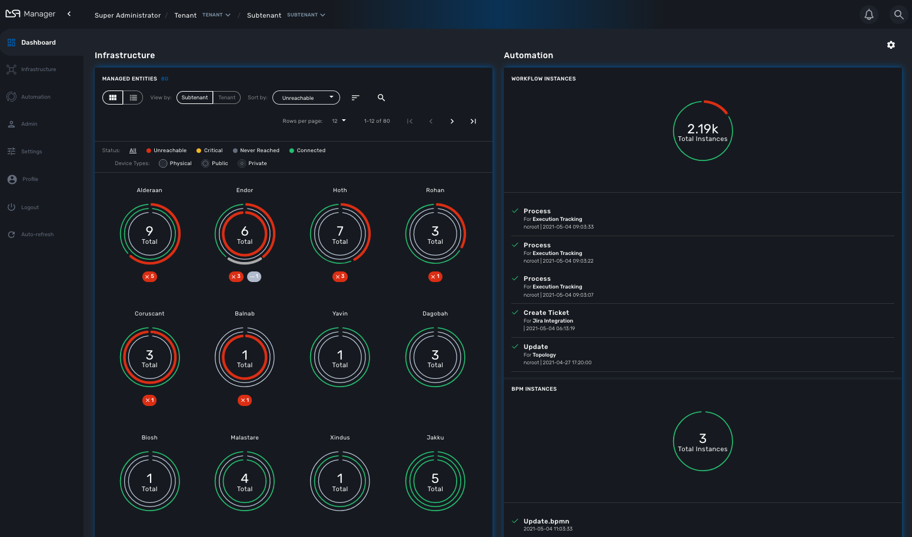
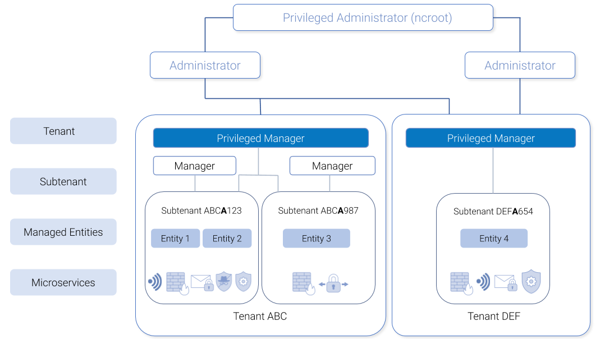

= Key Concepts
:doctype: book
:imagesdir: ./resources/
ifdef::env-github,env-browser[:outfilesuffix: .adoc]
:toc: left
:toclevels: 4 

== What is the {product_name} ?

{product_name} is the leading Integrated Automation Platform (IAP) engineered by UBiqube for the continuous design of any IT infrastructure automation process. 
It is composed of Infrastructure and Automation Modules. 

The Integration Module is used by infrastructure engineers to onboard / integrate the wide spectrum of related vendors and systems involved in any given IT solution, i.e. cloud
technologies (public/private, containers, etc.), networks systems (virtual and physical, optical, 5G, etc.), security systems, IoT systems and devices, etc.. 

The Automation Module provides the IT automation developer with a unified development environment for process design without concern for the underlying infrastructure technologies / vendors used, enabling an evergreen design.

== Understanding the Different Personas

On the {product_name} login screen, there are two different types of logins selectable via this toggle switch Administrator/Developer

Login as a developer, you can easily access and work on the design of your automation processes.

The swimlanes are matching the 3 layers of integration and automation: BPM, Workflows and Microservices

image:images/key_concepts_dev_dashboard.png[width=600px]

Login as an manager, you can directly start monitoring and managing your system.

.Manager
This will give you access to the manager dashboard, that allows you to monitor and manage the entities configured in your {product_name} installation.  
This dashboard represents the "Ops" half of the "DevOps" approach, see here for more details: link:gui_overview{outfilesuffix}#_administrator_and_manager_dashboard[GUI Overview]

.Developer
This will give you access to the developer dashboard, that allows you to design business processes, write workflows, or use visual workflows and develop microservices in your {product_name}.  
This dashboard represents the "Dev" half of the "DevOps" approach, see here for more details: 
link:gui_overview{outfilesuffix}#developer-dashboard[GUI Overview]

NOTE: The username and password you use to access either dashboard is the same, the selection on the login screen simply determines which dashboard you can see after logging in.

== Roles and Tenants

The {product_name} has 2 levels of tenancy: tenant and subtenant. 

These 2 levels will let you organise your managed entities based on your need will ensuring that access restriction based on the user role is fully respected.

4 user roles are available to make sure that you can assign the access and managing roles to your users based on their actual roles in your company.

.Tenants
A tenant contains a set of subtenants. The subtenants contain the managed entities and the deployment settings.

.Roles
- ncroot, the privileged admin has a global read/write access to the system.
- an admin as read/write access to a set of selected tenant.
- a privileged manager has read/write access to a tenant and his scope cannot go out of his tenant.
- a manager has a read-only access to a set of subtenants.

== Infrastructure

The term "Infrastructure" relates to Managed Entities, Microservices and Deployment Settings.

////
.Templates
Configuration Templates provide a simple way to provide what is termed in the Telco world as 'day 0' configuration during the activation managed entity.
////

=== Managed entities
The term "Managed Entity" encompasses manageable entities such as network elements (routers, switches, load balancer,etc.), security elements such as firewalls, UTM, etc. but also virtual infrastructure and cloud management layers such as Openstack, AWS, VMWare or even container management platforms such as Rancher, K8,...

=== Microservices 
Microservices can be used to manage a wide variety of services on numerous types of entities, such as network equipment, virtualization infrastructure managers, or even Linux servers.

Microservices is the abstraction layer between the specificities of the Managed Entities and the genericity required for a true multi-vendor management system.

Microservices will let you define your managed services in a fine-grained and modular manner and provide all the required functions to create, read, update, delete and import these services in a production environment.

The {product_name} configuration engine runs on PHP Smarty and allows some scripting to add logic to the generation of the configuration.

=== Deployment settings

Deployment settings are the logical entities that will bind together the Configurations and the Managed Entities.

== Automation
{product_name} features two automation layers designed for different degrees of abstraction that ensure maximum flexibility.

=== Workflow
The link:automation_workflows{outfilesuffix}[Workflow] layer addresses domain-specific scenarios which can be highly technically scripted, appealing to DevOps and SecOps engineers. 

=== BPM
The link:bpm{outfilesuffix}[BPM] layer offers a visual workflow editor to make {product_name} a strong SOAR contender for business process design which appeals to realities and is not enshrined in vendor-specific boundaries. Maximum security remediation policies can be applied as engineers creatively imagine a process applied to all domains involved (security, routing, switching, cloud hosting, etc.).

== The UI

*Vision*: {product_name} is to enable a ‘DevOps-ready’ Integrated Automation Platform to enable the design of multi-vendor, multi-cloud solutions across the entire tech ecosystem (datacenter to WAN, edge computing and IoT: all wrapped with security).

*Target users*:  SI engineers developing (DevOps) end-to-end solutions for their business customers, or end-users managing the lifecycle of their infrastructure or the services they are deploying (Telco, Cloud, MSSP, etc.).

A UX reflecting the above wide variety of technical scenarios and user experiences was required and it became obvious that *this redesign was becoming a critical enabler of this strategy*.

. The {product_name} UI provides two navigation environments to address both types of user:
* *A developer-centric environment*.
* *An end-user-centric environment*.
. A UX structure in line with our modular {product_name} architecture (microservices, workflows, etc.) for consistency and greater concept adoption.
. A universal taxonomy (naming and tagging) that would appeal to the entire ecosystem no matter the domain or the use case (datacenter, services, security, networking, wireless, wireline, IoT, etc.).
. A modern UX where navigation user experience matters more than feature list.
. A UX that connects to our community for greater intel and information-sharing among all of the {product_name} users and developers.
. A UX that becomes an evergreen platform, which we continue to improve over time, making our ‘agility by design’ claim a tangible reality for our customers and partners.
. A UX that becomes a strategic module of the {product_name} strategy as we head towards 5G, edge computing and IoT. 

=== Terminology

The 7 terms that define the tree of the {product_name} navigation:

[frame=none, cols="2*"]
|===

a|
 
 1. Infrastructure 
 
   a. Managed Entities
 
   b. Microservices 
 
   c. Deployment Settings
 
 2. Automation 
 
   a. BPM 
 
   b. Workflow
 
| 
 image:images/terminology.png[alt=Terminology, width=200]
|===

