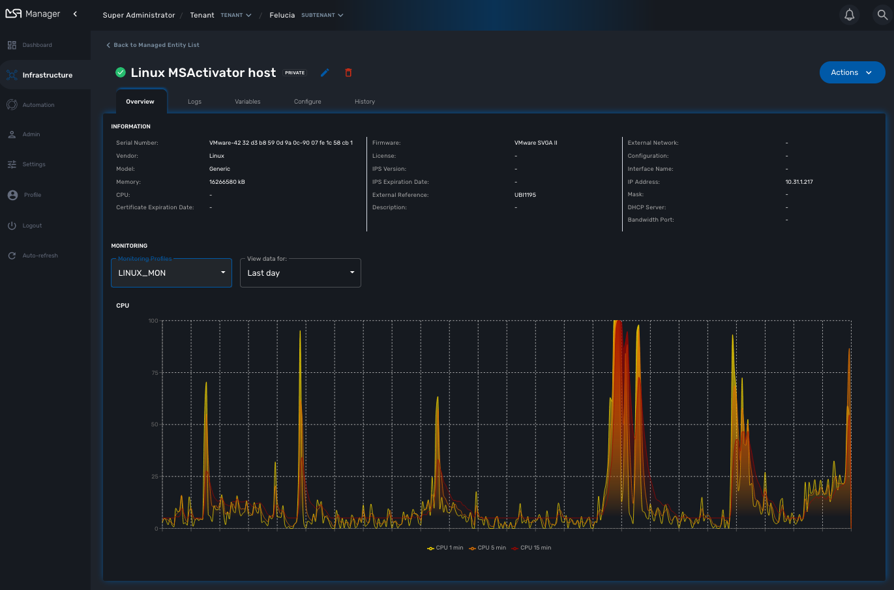

= Managed Entities
:doctype: book
:imagesdir: ./resources/
ifdef::env-github,env-browser[:outfilesuffix: .adoc]
:toc: left
:toclevels: 4 
:source-highlighter: pygments

In order to become a manageable entity, an entity such as a router, a firewall or any other network function or element, physical or virtual, has to be created and activated in the {product_name}.

These entities are managed in the "Infrastructure" section of the {product_name} web UI.

On this screen you can create a new manage entity or browse to an existing one to manage it.

This screen provides 3 types of view and you can switch between the detailed view, the compact view or the link:managed_entities_topology{outfilesuffix}[topology] view.

image:images/me_detailed_list.png[width=1000px]

== Create, update and activate a managed entity

To create a managed entity, click the "Create" button on the managed entity Listing page.
 
This will bring you to the form to create a managed entity.

The fields marked with a * are mandatory to create a managed entity. 
If a tenant or customer is selected on the global filter, then they will be pre-populated in the form. Otherwise a tenant and customer must be selected.

The selections in the "Vendor" and "Model" fields will determine the fields displayed in the "Management Information" and "Advanced Information" sections. 
Different managed entity types have different associated variables that are used in their provisioning and operation.

NOTE: the selection of the vendor and model will determine the Adapter that will be used by the CoreEngine for configuration and assurance. 
It's important to select an adapter that is compatible with the managed entity model.
Once a managed entity is created, it is not possible to change the model, the managed entity will have to be recreated.

The managed entity creation form can be closed by pressing the "X" button in the top bar. Any data entered into the fields will be preserved for when the user returns to the form. Clicking the "Discard Changes" button will display a prompt confirming that all changes will be lost. 
If the user accepts the form state will be reset.

The update form can be accessed by clicking the pencil icon on the managed entity Listing page or on the managed entity Detail page.

[#me_form_fields]
=== Managed entity fields

These are the fields available when creating a managed entity. Some are mandatory and this is made explicit by the * on the web form.

NOTE: All of these values are stored in the database and available to use by the Microservices, the Workflow, the API and the Adapters.

==== Tenant and subtenant

.Select the tenant and subtenant the managed entity will belong to. 

Only available when creating a managed entity, you can't chnange this value once the managed entity is created. If you selected the wrong tenant or subtenant you will have to recreate the managed entity.

==== Basic information

.Select the vendor and model for the managed entity.
This will select the adapter the {$product_name} link:../admin-guide{outfilesuffix}#overview[Core Engine] will use for configuring and monitoring the managed entity

.Select the nature of the Mmanaged entity
The nature of the managed entity is an additional information that will help you organize your infrastructure into physical devices and virtual (private or public) ones

==== Administrative information

.Set a name for the managed entity

The name is a free text field that you can use to identify your managed entity. 

NOTE: Although the value unicity is not enforced by the {$product_name} data model, it is very common to use a hostname for the name field.

==== Management information

.Management IP address
This is the IP address the {$product_name} will use to manage and monitor the entity. FQDN are not supported.

.Management interface name
You can optionaly set the management interface name here. When set, the Core Engine will use it to poll the management interface traffic with SNMP.

.Hostname
The hostname of the managed entity.

.Management port
The management port is set to 22 by default and is used as is by most CLI command based adapters but for REST API adapters you'll have to set it to the correct value.

==== Advanced information
.SNMP monitoring
Set the SNMP community configured on the actual managed entity. 
Optionaly set the monitoring port if it is not the default one (161)

.Log analytic
Check to collect syslogs and optionaly analyse the syslogs. The syslogs will be parsed and stored in the link:../admin-guide{outfilesuffix}#overview[Elasctisearch cluster].

.Credentials
Provide the credential to authenticate to the manage entity.

[#me_conf_var]
=== Configuration variables

In addition to the UI fields, it is also possible to create custom additional configuration variable to a managed entity. Configuration variables are offer a convenient way to extend the data model of the managed entity without any core product customisation.

A configuration variables is a key/value couple stored in the database, associated to a managed entity.

Once a configuration variable is set on a managed entity, it is available to the microservices, the configuration templates and the device adapter but it can also simply be used to add additional administrative information to a managed entity.

.Example 1: the REST generic adapter
The link:../developer_guide/adapter_development{outfilesuffix}#rest_adapter[REST generic adapter] uses configuration variables to customise it's behavior and adapt itself to the various type of REST API (BASIC auth vs. Token auth, HTTP vs. HTTPS,...)

[source, PHP]
----
$network = get_network_profile();       <1>
$sd = &$network->SD;

if (isset($sd->SD_CONFIGVAR_list['PROTOCOL'])) {
	$protocol=$sd->SD_CONFIGVAR_list['PROTOCOL']->VAR_VALUE; <2>
}
----
<1> read the managed entity data from the database
<2> get the value of the configuration variable `PROTOCOL`

.Example 2: in a microservice
In a microservice, you can reference any configuration variable with the syntax `{$CONFIG_VAR_NAME}`.

In a Import function, you can use a configuration variable to make the command to run on the device more flexible.

----
sho access-lists ACL-CUST{$CUSTOMER_REF} <1>
----
<1> make the name of the ACL depend on a configuration variable `CUSTOMER_REF`

To set these configuration variables, you can use the link:../developer-guide/rest_api{outfilesuffix}#conf_variables[REST API]which is useful for all your integration use cases or you can use a link:automation_workflow_utilities{outfilesuffix}#conf_variables[workflow from the library].

[#me_activation]
== Managed entity activation
A managed entity can be activated by pressing the "Activate" button the managed entity Detail screen.

This will show a form that takes the variables such as management IP, username and password that will be used in the activation. 
These fields may be pre-populated by the values given in the create form. 
If the variables are updated they will be used for that particular activation but will not be persistent.

When the activation is started the dialog shows the progress of the managed entity activation. 
This will update as the activation progresses and will show whether the activation succeeds or fails.

NOTE: the activation of the managed entity is executed by the adapter for this managed entity model.

== Overview screen

The overview screen is the main screen you will see when browsing to a managed entity

The managed entity overview screen is used to display the details of the selected entity as well as assurance related information

You can reach this screen via searching for a managed entity via the global search feature in the top navigation, or by selected an entity in the managed entities list.

The information such as the serial number, firmware, memory ... are retreived dynamically by the adapter once the entity is activated.

== Configuration with microservices

Managed entities can be configured with link:microservices{outfilesuffix}[microservices]. To access the microservice console, click on the tab "Configure" on the managed entity screen.

In order to be able to use one or several microservices to configure a managed entity, the microservices must be associated to the managed entity via link:configuration_deployment_settings{outfilesuffix}[deployment settings].

Once associated to the managed entity, you can navigate to the managed entity tab "Configure" to access the link:microservices{outfilesuffix}#microservice-console[microservice configuration console].

On the left menu of the console, you can see the list of the microservices that are associated to the current managed entity with the deployment setting.

=== Synchronisation with the managed entity

In order to import the configuration from the actual managed entity into the {product_name} configuration database, you need to click on the link "Synchronize with Managed Entity".

This will call the CoreEngine and run the Import of each of the microservice.

The Import function may not always be implemented (this depends on the design of the microservice), therefore, the CoreEngine will simply skip these microservices.

Once the synchronization is done, the console will display the microservice instance, one by line, for each microservice.

In order to ensure that the configuration stored in the database is exactly reflecting the actual configuration of the managed entity, the microservice instances, specific to the current managed entity, are deleted from the database before the actual import can start.

=== Configuration of the managed entity

You can create a new microservice instance by selecting a microservice on the left menu and clicking "+ Add Row" and providing the input parameters to configure.

The input parameters are defined in the microservice "Variable" section.

IMPORTANT: "+ Add Row" is only available when the Create function of the selected microservice is implemented.

To update or delete a microservice instance, you need to select the row and click on "Edit" or "Remove". 

IMPORTANT: "Edit" or "Remove" actions are only available if the Update or the Delete functions of the microservice are implemented.

Once you have updated your microservice, you can either click on "Discard Changes" or "Apply Changes".

"Discard Changes" will remove all the orders that where stacked and stored in memory.

"Apply Changes" will unstack all the orders and pass all the orders that were stacked to the CoreEngine configuration daemon.
The configuration daemon will process the order, build the configuration and apply on the managed entity.

//// 

include::./managed_entity_lifecycle{outfilesuffix}[]

include::./managed_entity_history{outfilesuffix}[]

////
