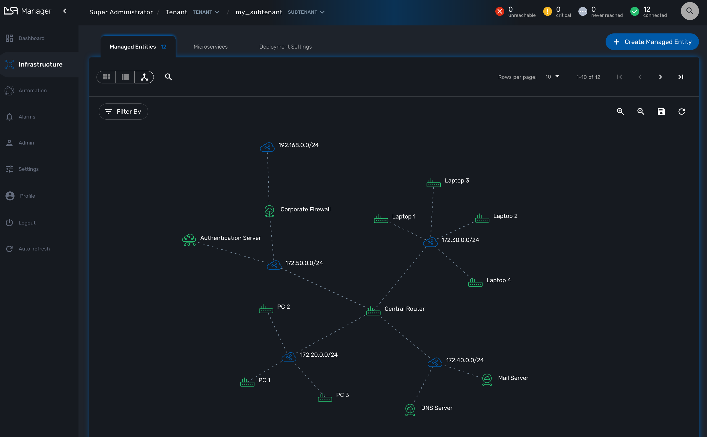
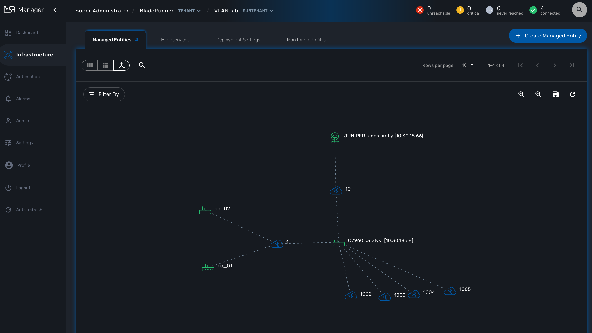

= Network Topology
:doctype: book
:imagesdir: ./resources/
ifdef::env-github,env-browser[:outfilesuffix: .adoc]
:toc: left
:toclevels: 4 

The topology view is available on the portal and provides a graphical view of your network. 

== Topology view

The topology view is available in the "Infrastructure" section of the web user interface, in the tab "link:managed_entities{outfilesuffix}[Managed Entities]".

When you browse to the topology view for the first time, the topology will be computed automatically based on the L3/SNMP topology mode (see below).

You can refresh the topology view, for instance after your infrastructure has been updated by clicking on the refresh button on the top right corner of the topology canvas.

You can also zoom in and out and re-arrange the layout of the nodes by dragging them with your mouse.

If you want to persist the layout, you can save the topology with the save button on the top right corner of the topology canvas.

== Topology types

2 types are available to build and display the topology view:

- Layer 3 view based on SNMP
- Layer 2 view based on VLAN

=== SNMP

The L3 SNMP mode relies on SNMP resquest to the managed entities to build the topology graph.

==== Prerequisites

SNMP must be enabled on the managed entities with a read-only community. 
The community must also be set on the managed entity on the {$product_name} link:managed_entities{outfilesuffix}#me_form_fields[managed entity form].

==== How it works

The topology is calculated by a workflow link:https://github.com/openmsa/Workflows/tree/master/Topology[Topology]. This workflow is automatically associated to the current subtenant when you browse to the topology screen in the "Infrastructure" section.

When you load or refresh the topology, the workflow will either create a new instance or update the last one that was created. It will loop thru each managed entity of the subtenant and execute the CLI command below for each one.

----
snmpwalk -v2c -c <community> <address> IP-MIB::ipAdEntNetMask
----

The SNMP mode will rely on the CLI command `snmpwalk -v2c -c <community> <address> IP-MIB::ipAdEntNetMask` to get the list of IP address and network mask from the link:http://www.net-snmp.org/docs/mibs/ip.html[IP MIB object].

----
ipAdEntNetMask OBJECT-TYPE
    SYNTAX     IpAddress
    MAX-ACCESS read-only
    STATUS     deprecated
    DESCRIPTION
           "The subnet mask associated with the IPv4 address of this
            entry.  The value of the mask is an IPv4 address with all
            the network bits set to 1 and all the hosts bits set to 0."
    ::= { ipAddrEntry 3 }
----

For each managed entity, the topology workflow will get the list of IPv4 address of this MIB entry and it will build a data structure, stored in the {$product_name} workflow database, to represent the topology as a graph with links and nodes.

=== VLAN

