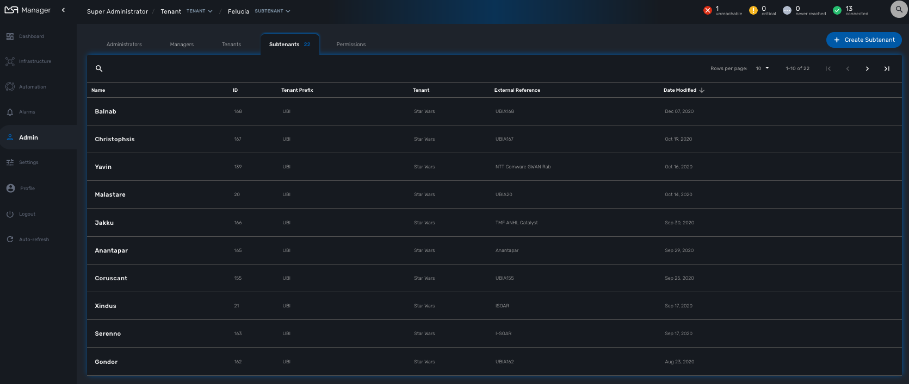
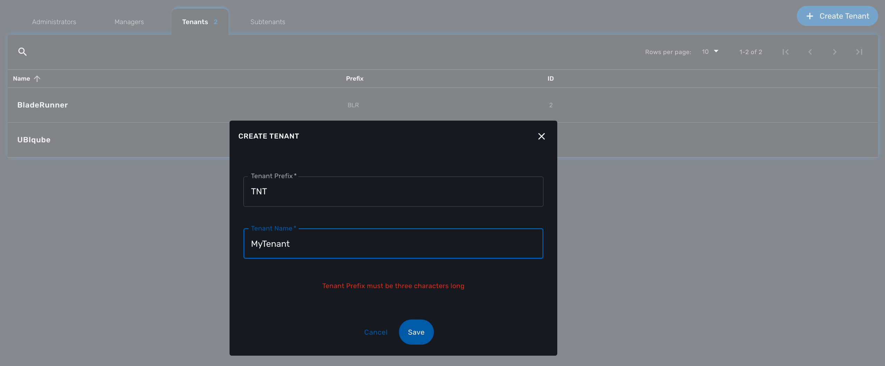
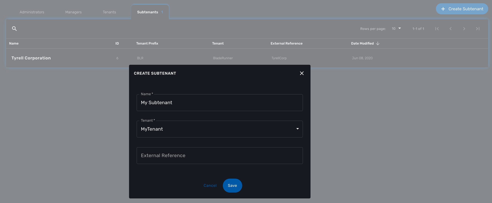

= Tenants and Users
:doctype: book
:imagesdir: ./resources/
ifdef::env-github,env-browser[:outfilesuffix: .adoc]
:toc: left
:toclevels: 4 

After installing, configuring and activating the {product_name}, you will start creating tenants and users.

This guide will walk you through the initial process of connecting and creating tenants and users.

Tenant and user management screens are available in the "Admin" section of the {product_name} UI.

== Initial connection

The {product_name} comes with one pre-created super admin user: ncroot (the equivalent of the root user on Linux systems). The default password for this user is "ubiqube".

This default password should be changed, especially if the {product_name} is meant to be used in a production environment.

== Overview

The {product_name} has 2 levels of tenancy: tenant and subtenant. 

These 2 levels will let you organise your managed entities based on your need will ensuring that access restriction based on the user role is fully respected.

4 user roles are available to make sure that you can assign the access and managing roles to your users based on their actual roles in your company.

image:images/concepts_tenants_users.png[width=1000px]

== Tenancy management

The {product_name} is designed to provide multi-tenancy. A tenant is a virtual private space that can be managed as an isolated environment.

There are two levels of tenancy, tenant and subtenant, the latter being nested in the first one.

Tenancy management is provided on the UI in the "Admin" section on the left menu.

=== Tenant

Select the "Tenants" section in the "Admin" menu and click on the "+ Create Tenant" button to create a new tenant.

The "Tenant Prefix" is a three letters, unique identifier for the tenant. It will be combined with the subtenant or the managed database identifier to build a short, comprehensive, unique identifier that you can use to filter application logs when troubleshooting or when you need to communicate with the support team.

=== Subtenant

Select the "Subtenants" section in the "Admin" menu and click on the "+ Create Subtenant" button to create a new subtenant.

Carefully select the tenant where the subtenant will be created as moving a subtenant to another tenant is not possible without database update.

//// 
TODO : update
In the "Contacts" form, the email is a mandatory field. 

This email will be used to send alarms. Alarm management is explained in the Alarm Management guide.
////

Save the customer form and navigate to the new subtenant tenant (click on the subtenant name in the customer list).

== User management

Four types of users are available:

    - ncroot, the privileged administrator
    - the administrator users
    - the privileged manager users
    - the manager users

=== Privileged administrator (ncroot)

ncroot is the only predefined user within the {product_name}. It's the user with the highest level of privilege. 

In addition to the action available to the other users with lower privileges, ncroot can create the tenants, upload and activate the {product_name} product licenses, create administrator users.

=== Administrator

Administrator users can only be managed by ncroot.

Administrators are associated with one or more tenants and have full access rights over these tenants.

A typical administrator job is to create the managers and privileged manager as well as the subtenant within its tenants.

=== Privileged manager and manager

Privileged managers are restricted to a single tenant.

Within their tenant, privileged managers have full access rights and can perform tasks such as subtenant management, device management, user and rights management.

Managers are restricted to a single tenant and, within this tenant, to a subset of subtenants.

By default, managers have restricted, read-only access to the subtenant.

A manager may be used to provide selfcare access to the {product_name} portal.

////
TODO
=== Roles and rights management

The {product_name} provides a simple authorization mechanism based on 4 user roles, the privileged administrator, the administrator, the privileged manager, and the manager.

By default, a manager has very restricted access to the data. They can only view the information of the customer and devices they are entitled to. In order to grant more rights to a manager, it is possible to use a delegation profile.

A delegation profile is an aggregation of rights such as "create a device", "activate a device", "configure a device",... that are turned on or off depending on your user management policy. This profile is applied to a set of one or more users.

NOTE: Delegation profile is a key feature for configuring and providing Selfcare management to an end-user. See Portal Overview for more details.
////

